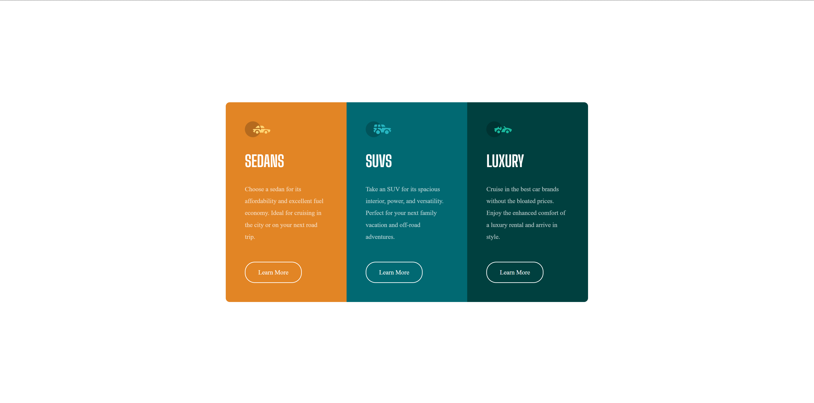
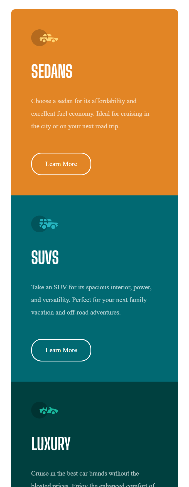

# 🔲 3-Column Preview Card Component

This is a solution to the [3-column preview card component challenge on Frontend Mentor](https://www.frontendmentor.io/challenges/3column-preview-card-component-pH92eAR2-).  
The goal is to build a responsive 3-column layout card using **HTML** and **CSS** only — no JavaScript involved.

---

## 🖼️ Preview

---

## 🌐 Live Demo

🔗 [Click here to view live project](https://your-username.github.io/css-projects/Frontend%20Mentor/3-column-preview-card-component-main/)

---

## 🔧 Built With

- Semantic HTML5 markup  
- Modern CSS (Flexbox)  
- Mobile-first responsive design  
- Google Fonts

---

## 📁 Folder Structure

├── index.html
├── style.css
├── images/
└── README.md

