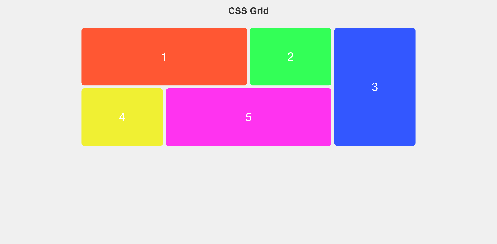
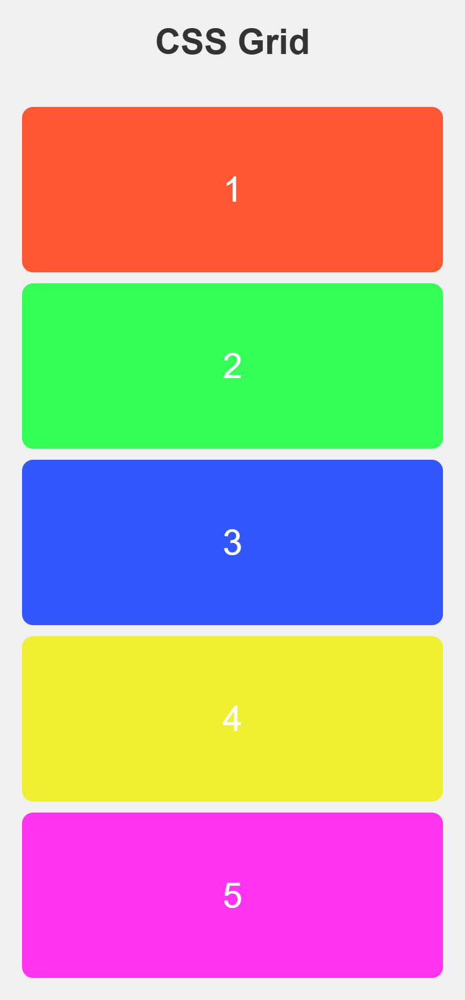
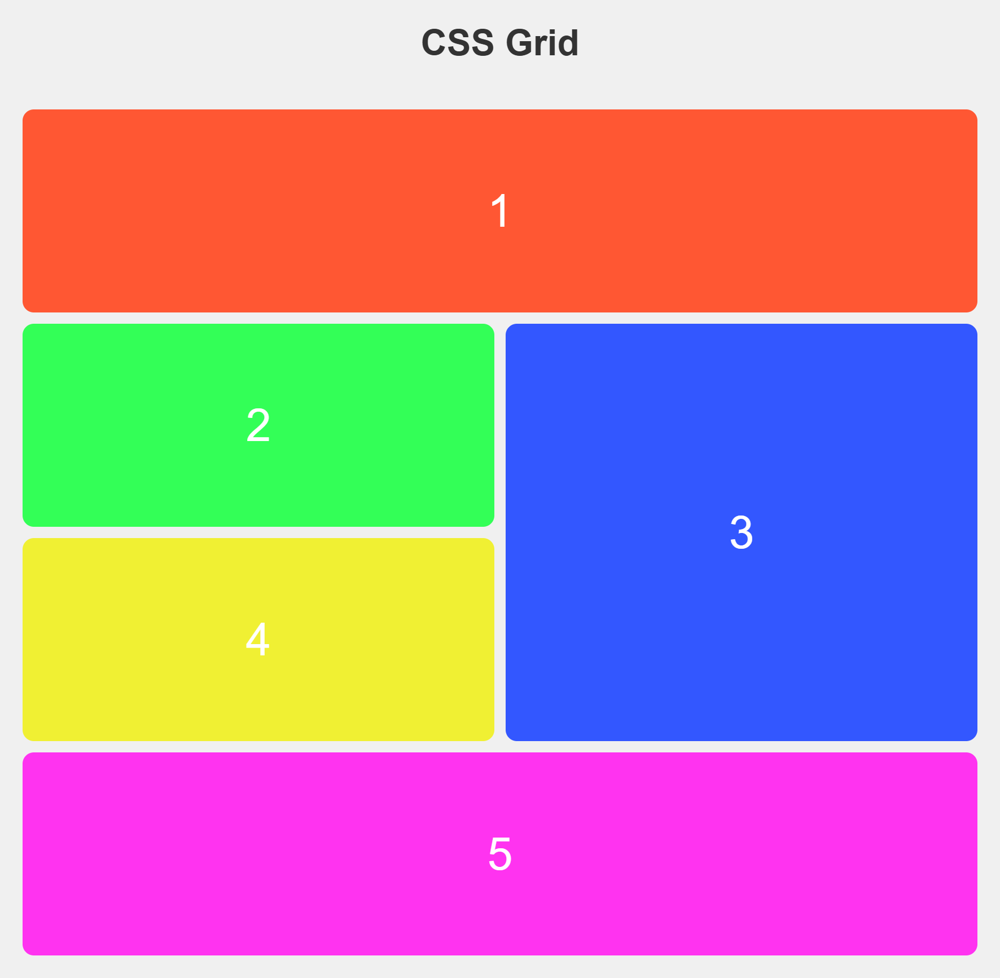

# 📱 QR Code Component

This is a solution to the [Css-Grid-Project](https://www.frontendmentor.io/challenges/testimonials-grid-section-Nnw6J7Un7).  
The goal is to build a clean and centered QR code card using **HTML** and **CSS** only — no JavaScript involved.

---

## 🖼️ Preview

---

## 🌐 Live Demo

🔗 [Click here to view live project](https://your-username.github.io/css-projects/Frontend%20Mentor/Css-Grid-Project/)

---

## 🔧 Built With

- Semantic HTML5  
- CSS Flexbox  
- Mobile-first design  
- Clean and minimal layout principles

---

## 📁 Folder Structure

├── index.html
├── style.css
├── images/
└── README.md

