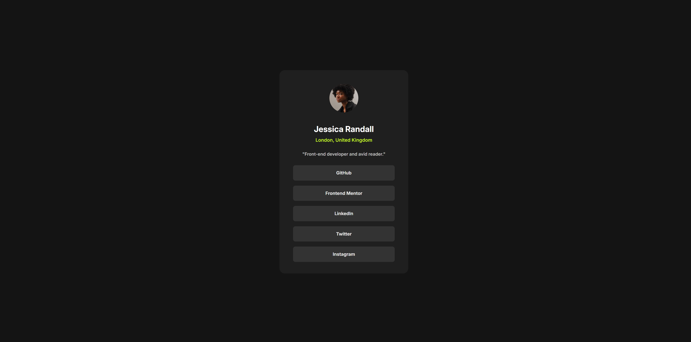
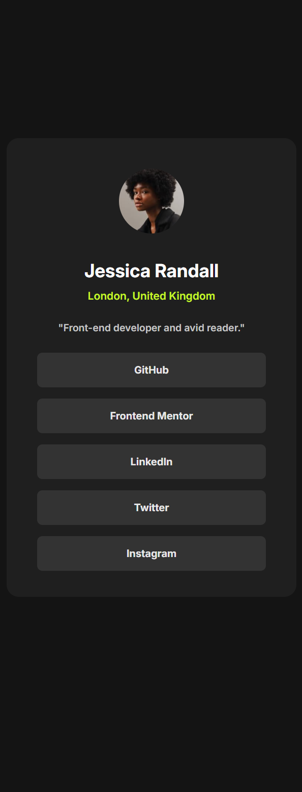

# 👤 Social Links Profile

This is a solution to the [Social links profile challenge on Frontend Mentor](https://www.frontendmentor.io/challenges/social-links-profile-UG32l9m6dQ).  
The goal is to build a clean, responsive profile card with social media links using only **HTML** and **CSS** — no JavaScript involved.

---

## 🖼️ Preview

  

---

## 🌐 Live Demo

🔗 [Click here to view live project](https://your-username.github.io/css-projects/Frontend%20Mentor/Social-links-profile-main/)

---

## 🔧 Built With

- Semantic HTML5  
- CSS Flexbox  
- Responsive design (mobile-first)  
- Google Fonts  
- Button hover effects

---

## 📁 Folder Structure

├── index.html
├── style.css
├── images/
└── README.md