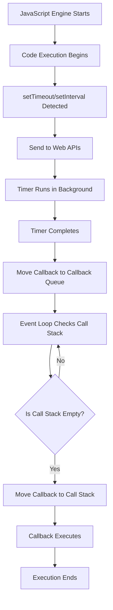

### 🧭 JavaScript Topics - Internal Links Table

| No. | Topic | Link |
|-----|-------|------|
| 1️⃣ | 📘 Introduction to JavaScript | [🔗 Go](#-introduction-to-javascript) |
| 2️⃣ | 📗 How to Use JavaScript in HTML | [🔗 Go](#-how-to-use-javascript-in-html) |
| 3️⃣ | 📕 JavaScript Syntax and Statements | [🔗 Go](#-javascript-syntax-and-statements) |
| 4️⃣ | 📙 JavaScript Data Types | [🔗 Go](#-javascript-data-types) |
| 5️⃣ | 📒 JavaScript Type Conversion | [🔗 Go](#-javascript-type-conversion) |
| 6️⃣ | 🧾 JavaScript Variables | [🔗 Go](#-javascript-variables) |
| 7️⃣ | ⚙️ JavaScript Code Execution Process | [🔗 Go](#-javascript-code-execution-process) |
| 8️⃣ | 💬 JavaScript Dialog Boxes | [🔗 Go](#-javascript-dialog-boxes) |
| 9️⃣ | 💡 JavaScript Template Literals & String Methods | [🔗 Go](#-javascript-template-literals--string-methods) |
| 🔟 | 📐 JavaScript Math Object | [🔗 Go](#-javascript-math-object) |
| 1️⃣1️⃣ | 🧪 JavaScript Truthy and Falsy Values | [🔗 Go](#-javascript-truthy-and-falsy-values) |
| 1️⃣2️⃣ | ➕ JavaScript Operators | [🔗 Go](#-javascript-operators) |
| 1️⃣3️⃣ | 🤔 JavaScript Decision Making | [🔗 Go](#-javascript-decision-making) |
| 1️⃣4️⃣ | 🕵️ How to See JavaScript Variable Address in Chrome DevTools | [🔗 Go](#-how-to-see-javascript-variable-address-in-chrome-devtools) |
| 1️⃣5️⃣ | 📦 JavaScript Objects Full Guide | [🔗 Go](#-javascript-objects-full-guide) |
| 1️⃣6️⃣ | 📚 JavaScript Arrays Full Guide | [🔗 Go](#-javascript-arrays-full-guide) |
| 1️⃣7️⃣ | 📤 JavaScript Shallow Copy vs Deep Copy | [🔗 Go](#-javascript-shallow-copy-vs-deep-copy) |
| 1️⃣8️⃣ | 🔁 JavaScript While Loop | [🔗 Go](#-javascript-while-loop) |
| 1️⃣9️⃣ | 🔄 JavaScript for Loop | [🔗 Go](#-javascript-for-loop) |
| 2️⃣0️⃣ | ⏬ JavaScript do...while Loop | [🔗 Go](#-javascript-dowhile-loop) |
| 2️⃣1️⃣ | 🧠 JavaScript Function | [🔗 Go](#-javascript-function) |
| 2️⃣2️⃣ | 🔬 Execution Context in JavaScript | [🔗 Go](#-execution-context-in-javascript) |
| 2️⃣3️⃣ | 📈 Hoisting in JavaScript | [🔗 Go](#-hoisting-in-javascript) |
| 2️⃣4️⃣ | 🌐 JavaScript Scopes | [🔗 Go](#-javascript-scopes) |
| 2️⃣5️⃣ | 🧩 Higher Order Functions in JavaScript | [🔗 Go](#-higher-order-functions-in-javascript) |
| 2️⃣6️⃣ | 🕰️ JavaScript Event Loop + Callback Queue + Web APIs | [🔗 Go](#-javascript-event-loop--callback-queue--web-apis) |
| 2️⃣7️⃣ | 📎 Difference between Methods and Functions in JavaScript | [🔗 Go](#-difference-between-methods-and-functions-in-javascript) |
| 2️⃣8️⃣ | 🎯 JavaScript Arrow Functions | [🔗 Go](#-javascript-arrow-functions) |
| 2️⃣9️⃣ | 🔍 for...of, for...in, and in Keyword in JavaScript | [🔗 Go](#-forof-forin-and-in-keyword-in-javascript) |
| 3️⃣0️⃣ | 🧰 JavaScript Array Methods: forEach, map, filter, reduce, some, every | [🔗 Go](#-javascript-array-methods-foreach-map-filter-reduce-some-every) |
| 3️⃣1️⃣ | 🧵 JavaScript: Parameters, Default Parameters, and arguments Keyword | [🔗 Go](#-javascript-parameters-default-parameters-and-arguments-keyword) |
| 3️⃣2️⃣ | 🧃 JavaScript: Spread Operator and Rest Parameter | [🔗 Go](#-javascript-spread-operator-and-rest-parameter) |
| 3️⃣3️⃣ | 📓 JavaScript Destructuring | [🔗 Go](#-javascript-destructuring) |


# 📘 Introduction to JavaScript

JavaScript is a **programming language** that allows us to add interactivity, behavior, and logic to websites.

When you visit a modern website and see things like:
- Image sliders,
- Form validation,
- Pop-up alerts,
- Drop-down menus,
- Dynamic content loading...

All of this is done using **JavaScript**!

## 🧠 What is JavaScript?

JavaScript is:
- A **client-side** (runs in the browser) scripting language.
- **Lightweight** and easy to learn.
- Used to **create dynamic and interactive** web pages.
- Supported by all major **web browsers**.
- Also used in **server-side development** using Node.js.

### ✅ Features of JavaScript

| Feature | Description |
|--------|-------------|
| 💻 Client-Side | Runs inside the user's browser without server interaction |
| 🚀 Fast | Runs quickly because it executes directly in the browser |
| 🔗 Interoperable | Works well with HTML & CSS |
| 🌐 Platform Independent | Can run on any device with a browser |
| 📚 Lightweight | Minimal syntax; easy to learn and write |
| 🔁 Dynamic | Handles real-time updates and user events |

## 📜 History of JavaScript

Let’s look at the background of this powerful language:

### 📅 1995 – Birth of JavaScript
- Created by **Brendan Eich** in just **10 days** at **Netscape**.
- First name: **Mocha**
- Then renamed to: **LiveScript**
- Final name: **JavaScript** (to ride on Java's popularity)

> 🔹 **Note**: Java and JavaScript are different languages.  
> The name similarity is just branding — they are NOT the same.

### 🌍 Evolution Timeline

| Year | Event |
|------|-------|
| 1995 | JavaScript created by Brendan Eich at Netscape |
| 1996 | Renamed to JavaScript |
| 1997 | Standardized by ECMA — first version called **ECMAScript 1 (ES1)** |
| 2009 | **ES5** released (important version, added many features) |
| 2015 | **ES6 / ECMAScript 2015** — major upgrade (let, const, arrow functions, etc.) |
| Now  | Yearly updates (ES7, ES8, ES9...) adding modern features |

### 🤔 Why Learn JavaScript?

- It’s one of the **core technologies** of the web (along with HTML & CSS)
- Used in:
  - Web apps
  - Mobile apps (React Native)
  - Server-side apps (Node.js)
  - Desktop apps (Electron)
  - Game development


### 🧪 Where Can JavaScript Be Used?

| Area | Examples |
|------|----------|
| Frontend | Form validation, sliders, animations |
| Backend | Server apps with Node.js |
| Mobile Apps | Android/iOS apps using React Native |
| Desktop Apps | Tools like VS Code, Slack using Electron |
| Games | 2D/3D browser games |

### ✅ Summary

- JavaScript is the **language of the web** 🌐
- It makes websites **interactive** and **dynamic**
- Created in 1995 by **Brendan Eich**
- Grown into a **powerful and universal language**

> ✨ “JavaScript is the brush that paints interactivity on the canvas of the web.”

#### [Practical Example Link](../Practical-Examples/Introduction_to_JavaScript/)
---
# 📘 How to Use JavaScript in HTML

JavaScript can be added to an HTML document in **three main ways**:  
1. ✅ Inline  
2. ✅ Internal  
3. ✅ External  

Let’s look at each method in detail with examples, pros, and cons.

## 1️⃣ Inline JavaScript

Inline JavaScript is written directly within an HTML element using the `onclick`, `onmouseover`, etc. attributes.

#### 🧪 Example:
```html
<button onclick="alert('Hello!')">Click Me</button>
```

#### ✅ Pros:
- Simple and quick for small actions
- Good for testing or debugging one-liners

#### ❌ Cons:
- Not suitable for large or complex code
- Hard to maintain and debug
- Violates separation of concerns (HTML & JS mixed)

## 2️⃣ Internal JavaScript

Internal JS is placed within `<script>` tags inside the `<head>` or `<body>` of the HTML file.

#### 🧪 Example:
```html
<!DOCTYPE html>
<html>
<head>
  <script>
    function showMessage() {
      alert("Welcome!");
    }
  </script>
</head>
<body>
  <button onclick="showMessage()">Click</button>
</body>
</html>
```

#### ✅ Pros:
- Better structure than inline
- Good for small projects or single-page applications

#### ❌ Cons:
- Still couples HTML and JavaScript
- Not reusable across multiple pages

## 3️⃣ External JavaScript

External JS is written in a `.js` file and linked to the HTML using the `<script src="...">` tag.

#### 🧪 Example:
**HTML File:**
```html
<!DOCTYPE html>
<html>
<head>
  <script src="script.js"></script>
</head>
<body>
  <button onclick="showMessage()">Click</button>
</body>
</html>
```

**script.js File:**
```javascript
function showMessage() {
  alert("External JS File Loaded!");
}
```

#### ✅ Pros:
- Clean separation of HTML and JavaScript
- Reusable and maintainable
- Cached by browsers (better performance)

#### ❌ Cons:
- Slightly more complex setup
- File must be loaded before it can be used (may need `defer` or `async`)

### 🧠 Best Practice

> ✅ **Use external JavaScript** for all real projects.  
> 🚫 Avoid inline scripts for anything beyond quick demos.

### 📌 Summary Table

| Type      | Location                     | Best For            | Pros                          | Cons                          |
|-----------|------------------------------|---------------------|-------------------------------|-------------------------------|
| Inline    | Inside HTML element          | Tiny scripts        | Easy & quick                  | Not maintainable              |
| Internal  | `<script>` in HTML file      | Small projects      | Organized but limited scope   | Not reusable across pages     |
| External  | Separate `.js` file          | Large applications  | Clean, reusable, maintainable | Setup slightly more complex   |

#### [Practical Example Link](../Practical-Examples/How_to_Use_JavaScript_in_HTML/)
---
# 🧾 JavaScript Syntax and Statements

This section covers the **basic structure**, **syntax rules**, and **types of statements** used in JavaScript.

## 📌 What is JavaScript Syntax?

JavaScript syntax is the set of rules that define a **valid JavaScript program**.

Just like grammar in a language, **JavaScript syntax** tells the interpreter how to read and execute code.

### 🧱 Basic Syntax Rules

| Syntax Component   | Example                          | Description                                |
|--------------------|----------------------------------|--------------------------------------------|
| Statements         | `let x = 10;`                    | Instructions that the browser can execute. |
| Semicolons         | `let y = 20;`                    | Ends most statements (optional, but best practice). |
| Comments           | `// single-line` or `/* multi-line */` | Explain or disable code.           |
| Case Sensitivity   | `var num` ≠ `VAR num`            | JavaScript is case-sensitive.              |
| Whitespace         | `let x = 5;` vs `let    x=5;`    | Ignored by JS (used for readability).      |

### ✍️ Writing Statements

#### 🔹 Declaration Statement
```js
let a = 5;
const name = "Vikash";
```
Declares variables using `let`, `const`, or `var`.

#### 🔹 Assignment Statement
```js
a = 10;
```
Assigns or updates the value of a variable.

#### 🔹 Function Call Statement
```js
alert("Hello!");
console.log("Debug message");
```
Invokes a built-in or user-defined function.

#### 🔹 Control Statements
```js
if (a > 0) {
  console.log("Positive");
}
```
Handles decisions, loops, and branches (`if`, `else`, `while`, `for`, etc).

#### 🔹 Block Statements
```js
{
  let x = 10;
  let y = 20;
}
```
Used to group statements together.

### ⚖️ Statement vs Expression

| Term         | Description                                         | Example             |
|--------------|-----------------------------------------------------|---------------------|
| Statement    | Complete instruction to be executed                 | `let x = 10;`       |
| Expression   | Produces a value and can be part of a statement     | `x + 5` or `"Hi"`   |

### 🔄 Best Practices

✅ Always end statements with semicolons (to avoid automatic semicolon insertion bugs).  
✅ Use meaningful variable and function names.  
✅ Indent and space your code for better readability.  
✅ Keep one statement per line.


### 📘 Summary

- JavaScript is case-sensitive and syntax-based.
- It is good practice to use **semicolons**, even though they’re optional.
- Statements are individual commands; expressions are values or calculations.
- Comments help explain your code and make it easier to maintain.

### ✅ Example Code:

```html
<!DOCTYPE html>
<html>
  <head>
    <title>JS Syntax Example</title>
    <script>
      // This is a single-line comment
      let name = "Vikash";
      let age = 22;

      if (age > 18) {
        console.log(name + " is an adult.");
      }
    </script>
  </head>
  <body>
    <h1>Check the Console!</h1>
  </body>
</html>
```
- If you don't understand some syntax like if else and some more don't worry we discuss this topics in very detailed in this JS notes.
#### [Practical Example Link](../Practical-Examples/JavaScript_Syntax_and_Statements/)

---
# 🔢 FUNDAMENTALS Of JavaScripts
---
# 🔢 JavaScript Data Types

JavaScript provides different types of values that can be stored in variables. These types are divided into **primitive** and **non-primitive (reference)** types.

## ✅ 1. Primitive Data Types

Primitive data types are immutable and stored directly in the variable.

| Type         | Description                              | Example               |
|--------------|------------------------------------------|-----------------------|
| `String`     | Textual data                             | `"Hello"`             |
| `Number`     | Integers or floating-point numbers        | `42`, `3.14`          |
| `Boolean`    | Represents `true` or `false`             | `true`, `false`       |
| `undefined`  | Variable declared but not assigned       | `let a; // undefined` |
| `null`       | Explicitly set to no value               | `let b = null;`       |
| `BigInt`     | Large integers beyond `Number` limits     | `12345678901234567890n` |
| `Symbol`     | Unique identifiers                       | `Symbol("id")`        |

## ✅ 2. Non-Primitive (Reference) Data Types

These are objects and are stored by reference.

| Type      | Description                    | Example                        |
|-----------|--------------------------------|--------------------------------|
| Object    | Key-value pairs                | `{ name: "Vikash", age: 22 }`  |
| Array     | Ordered list of items          | `[1, 2, 3]`                     |
| Function  | A block of reusable code       | `function greet() {}`          |
| Date      | Date and time                  | `new Date()`                   |

- .
- This guide focuses **only** on Primitive Data Types with detailed explanation and minimum **3–4 examples** each.
- .

## ✅ What are Primitive Data Types?

Primitive data types are the **most basic types of data**. They are:

* **Immutable** (cannot be changed after creation)
* **Stored directly by value**

There are **7 primitive types** in JavaScript:

### 🔹 1. String

- Used to store **textual data** (sequence of characters).
- String are indexable/Iteratable. Means We can access with index and we can use loop also.

#### Syntax:

```js
let name = "Alice";
```

#### Examples:

```js
let city = "Delhi";
let greeting = 'Hello, world!';
let message = `Welcome, ${city}!`;
let emptyString = "";     // Empty string
let quote = 'She said "Hi"';
```


### 🔹 2. Number

Used for all kinds of **numerical values**: integers, floats, etc.

#### Examples:

```js
let age = 25;
let temperature = -4;
let price = 99.99;
let pi = 3.14159;
let distance = 1.6e5; // Scientific notation (160000)
```


### 🔹 3. Boolean

Represents a **logical value**: either `true` or `false`.

#### Examples:

```js
let isLoggedIn = true;
let hasPermission = false;
let isAdult = age >= 18; // true
let isRainy = false;
```

### 🔹 4. Undefined

A variable that is declared but **not assigned** any value.

#### Examples:

```js
let data;
console.log(data); // undefined

let result = undefined;
console.log(typeof result); // "undefined"
```

### 🔹 5. Null

Used to explicitly assign **"no value"** to a variable.

#### Examples:

```js
let user = null;
let selectedColor = null;
let currentTask = null;
```

> 🔸 `null` is often used to indicate intentional absence of any object value.

### 🔹 6. Symbol (Introduced in ES6)

Represents a **unique and immutable** identifier.

#### Examples:

```js
let sym1 = Symbol("id");
let sym2 = Symbol("id");
console.log(sym1 === sym2); // false

let userID = Symbol("user");
let obj = {};
obj[userID] = 101;
```

### 🔹 7. BigInt (Introduced in ES2020)

Used to represent **very large integers** beyond the limit of Number type.

#### Examples:

```js
let bigNumber = 9007199254740991n;      // With 'n' suffix
let anotherBig = BigInt("123456789012345678901234567890");
console.log(bigNumber + 10n);           // 9007199254741001n
```

> 🔸 Use `n` suffix or `BigInt()` constructor to declare BigInt values.


### 📊 Summary Table – Primitive Types Only

| Data Type | Description                  | Example                        |
| --------- | ---------------------------- | ------------------------------ |
| String    | Textual data                 | "Hello", 'Hi', `Hello ${name}` |
| Number    | Integers and decimals        | 42, 3.14, -10, 1.5e3           |
| Boolean   | Logical true/false           | true, false                    |
| Undefined | Declared, not assigned       | let x;                         |
| Null      | No value (intentional)       | let x = null;                  |
| Symbol    | Unique, immutable identifier | Symbol("id")                   |
| BigInt    | Very large integers          | 1234567890123n                 |

### 🔍 Type Checking – Primitive Types

Use the `typeof` operator:

```js
console.log(typeof "Hello");    // string
console.log(typeof 42);         // number
console.log(typeof true);       // boolean
console.log(typeof undefined);  // undefined
console.log(typeof null);       // object (known bug)
console.log(typeof Symbol());   // symbol
console.log(typeof 123n);       // bigint
```

- ✅ **Note:** `typeof null === "object"` is a known JavaScript bug.

- ✅ JavaScript is a **dynamically typed** language — types are assigned at runtime.

- ✅ We can check the type of any type useing 'typepof'.

- ✅ Also we have a type NaN Not a Number. We Dicuss in this topic in upcoming topics.

#### [Practical Example Link](../Practical-Examples/JavaScript_Data_Types/)

---
# 📘 JavaScript Type Conversion 

JavaScript is a **dynamically typed language**, which means variables can hold values of any type and can change type at runtime.

There are **two main types of type conversion**:

* ✅ **Implicit Type Conversion (Type Coercion)**
* ✅ **Explicit Type Conversion (Type Casting)**

## 🔹 Implicit Type Conversion (Type Coercion)

JavaScript automatically converts data types when needed.

### ✅ Examples:

```js
// Number + String = String
let result1 = 10 + "";      // "10"
let result2 = 10 + "5";     // "105"

// Boolean to Number
let result3 = true + 1;     // 2
let result4 = false + 10;   // 10

// String - Number = Number
let result5 = "10" - 2;     // 8

// null to Number
let result6 = null + 5;     // 5

// undefined to Number results in NaN
let result7 = undefined + 1; // NaN
```

> ✅ JavaScript converts values to the appropriate type automatically **based on the operator**.

## 🔹 Special Cases – Coercion by Adding String

JavaScript coerces the type when one of the operands is a string in a `+` operation.

### ✅ Examples:

```js
let a = 10 + "";         // "10"
let b = 10 + " apples";  // "10 apples"
let c = "5" + 5;         // "55"
let d = 5 + 5 + "5";     // "105"
let e = "" + true;       // "true"
```

> ✅ When using the `+` operator, **if any operand is a string**, JavaScript converts the other operand to a string and performs **string concatenation**.

## 🔹 Special Case – Convert String to Number using `+` Operator

JavaScript allows converting strings into numbers by prefixing them with the `+` operator.

### ✅ Examples:

```js
let str1 = "100";
let num1 = +str1;        // 100 (number)

let str2 = "3.14";
let num2 = +str2;        // 3.14

let str3 = "abc";
let num3 = +str3;        // NaN

let str4 = "";
let num4 = +str4;        // 0
```

> 🔸 The unary `+` operator attempts to convert its operand to a number.

## 🔹 Explicit Type Conversion (Type Casting)

You manually convert values using functions or constructors.

### ✅ String Conversion:

```js
String(123);         // "123"
String(true);        // "true"
String(null);        // "null"

let num = 100;
let str = num.toString(); // "100"
```

### ✅ Number Conversion:

```js
Number("123");       // 123
Number(true);         // 1
Number(false);        // 0
Number("abc");       // NaN
parseInt("42");       // 42
parseFloat("3.14");   // 3.14
```

### ✅ Boolean Conversion:

```js
Boolean(0);           // false
Boolean(1);           // true
Boolean("");          // false
Boolean("hello");    // true
Boolean(null);        // false
```

> 🔸 Use `Boolean()`, `Number()`, `String()` for explicit conversions.

### 📊 Summary Table – Type Conversion

| Expression        | Result | Type    |
| ----------------- | ------ | ------- |
| `10 + ""`         | "10"   | String  |
| `true + 1`        | 2      | Number  |
| `"5" - 2`         | 3      | Number  |
| `"10 apples" - 5` | NaN    | Number  |
| `String(123)`     | "123"  | String  |
| `Number("abc")`   | NaN    | Number  |
| `Boolean("")`     | false  | Boolean |
| `+"100"`          | 100    | Number  |
| `+"abc"`          | NaN    | Number  |
| `+""`             | 0      | Number  |

## 🧠 typeof vs instanceof vs constructor

### ✅ typeof

Returns a string indicating the type.

```js
typeof 123;           // "number"
typeof "abc";        // "string"
typeof true;          // "boolean"
typeof null;          // "object" (known bug)
typeof undefined;     // "undefined"
```

### ✅ instanceof

Checks if an object is an instance of a constructor.

```js
[] instanceof Array;      // true
{} instanceof Object;     // true
new Date() instanceof Date; // true
```

### ✅ constructor

Returns the constructor function of the object.

```js
"hello".constructor;     // String()
(123).constructor;       // Number()
(true).constructor;      // Boolean()
```

## ⚠️ Common Pitfalls

```js
Number(" ");        // 0 (empty string is treated as 0)
Number(null);       // 0
Number(undefined);  // NaN

true + true;        // 2
false + true;       // 1
"10" + 1;           // "101" (string + number = string)
"10" - 1;           // 9     (string - number = number)
+"100";             // 100 (string to number)
```

#### [Practical Example Link](../Practical-Examples/JavaScript_Type_Conversion/)

---

# 🧾 JavaScript Variables

This section covers how to declare and use variables in JavaScript using `var`, `let`, and `const` — including rules, best practices, and common pitfalls.

## 🧠 What are Variables?

Variables are containers for storing data values. In JavaScript, you can declare variables using:

* `var` – Old way (function-scoped)
* `let` – Modern way (block-scoped)
* `const` – Block-scoped, but cannot be reassigned

### 🧪 Syntax:

```js
let age = 25;
const name = "Vikash";
var city = "Delhi";
```

## 📦 Types of Variable Declarations

### 🔹 var

```js
var x = 10;
```

* Function-scoped
* Can be re-declared and updated
* Avoid in modern JS

### 🔹 let

```js
let y = 20;
```

* Block-scoped
* Can be updated but not re-declared in the same scope

### 🔹 const

```js
const z = 30;
```

* Block-scoped
* Cannot be updated or re-declared
* Must be initialized at declaration

## ⚠️ What if we don’t use var, let, or const?

```js
a = 10;
```

* This creates an **implicit global variable**, even if written inside a function.
* It is considered **bad practice** because:

  * It pollutes the global scope.
  * It can cause **unintended side effects**.
  * It makes debugging harder.
  * Use 'use strict' in top of the js file for avoiding this type error. Use srtict ensure that the all variables are decleare in correct way.

✅ **Avoid this pattern**. Always declare variables using `let`, `const`, or `var` to keep your code safe and predictable.


## 🧠 Storing Type Behind the Scenes

When you write:

```js
let a = 10;
```

* JavaScript creates a variable `a` that stores a **reference** (or memory address) to the value `10` in memory.
* For **primitive types** (numbers, strings, booleans, null, undefined, symbol, bigint), the value itself is stored.
* For **non-primitive types** (like objects, arrays, functions), the variable stores a **reference** to the memory location.

📌 In essence, variables are **pointers** to values stored in memory — either directly (for primitives) or indirectly (for objects).

Example:

```js
let x = 10;           // x points directly to 10
let arr = [1, 2, 3];  // arr holds reference to the array in memory
```

## 📏 Naming Rules

* Can include letters, digits, underscores, `$`
* Must begin with a letter, `_`, or `$`
* **Case-sensitive** (`myVar` ≠ `myvar`)
* Should not use reserved words (like `return`, `function`, etc.)

✅ Prefer camelCase (`userAge`, `totalAmount`)

## 🔤 Variable Naming Cases

### 🔹 camelCase

* Most common in JavaScript

```js
let firstName = "John";
```

### 🔹 PascalCase

* Common in class names

```js
class UserProfile {
  constructor() {}
}
```

### 🔹 snake\_case

* Rare in JS (used in other languages like Python)

```js
let user_name = "john_doe";
```

### 🔹 kebab-case

* ❌ **Not allowed in variable names** (used in file names, CSS classes)

```js
// let user-name = "John"; ❌ SyntaxError
```

## 🔄 Re-declaration and Re-assignment

```js
var a = 10;
var a = 20; // allowed

let b = 30;
b = 40;     // allowed
// let b = 50; ❌ SyntaxError

const c = 60;
c = 70;     // ❌ TypeError
```

## 💡 Best Practices

* Use `const` by default.
* Use `let` when reassignment is needed.
* Avoid `var` in modern JavaScript.
* Declare all variables at the top of their scope.


### ✅ Example:

```js
const firstName = "Vikash";
let age = 22;
var country = "India";

console.log(`${firstName} is ${age} years old and lives in ${country}`);
```

### 📘 Summary

* Always declare variables using `let` or `const`.
* Avoid undeclared variables (like `x = 5`).
* Prefer `const` unless reassignment is necessary.
* Use meaningful variable names for better readability.
* Use `camelCase` for variable names and `PascalCase` for class names.
* Understand the memory model: primitives store values directly, non-primitives store references.

#### [Practical Example Link](../Practical-Examples/JavaScript_Variables/)

---
# ⚙️ JavaScript Code Execution Process

JavaScript executes code in two main phases whenever it runs a script:
(JavaScript jab bhi code chalata hai, woh do main phases mein kaam karta hai:)


## 🔹 1. **Memory Creation Phase** (a.k.a. **Creation Phase** or **Hoisting Phase**)

(Phase 1: Memory Creation Phase ya Creation Phase ya Hoisting Phase ke naam se bhi jana jata hai)

### ✅ What Happens in This Phase:

(Is phase mein kya hota hai:)

* A **global execution context** is created.
  (Ek global execution context create hota hai.)
* A **`this` binding** is set (refers to the global object like `window` in browsers).
  (`this` keyword global object ko point karta hai, browser mein `window` hota hai.)
* **Memory is allocated** for:
  (Memory allocate hoti hai:)

  * **Variables** → Initialized with `undefined`
    (Variables ko memory milti hai aur unka value `undefined` set hota hai.)
  * **Functions** → Entire function definitions are stored
    (Functions ka pura definition memory mein store ho jata hai.)
* **Hoisting** occurs:
  (Hoisting hoti hai:)

  * Variables declared with `var` are hoisted and initialized with `undefined`
    (`var` se declare kiye gaye variables upar uth jaate hain aur `undefined` set hote hain.)
  * Functions declared using the `function` keyword are hoisted completely (including the body)
    (`function` keyword se declared functions puri tarah se upar uth jaate hain, body ke saath.)
  * Variables declared with `let` and `const` are hoisted but not initialized
    (`let` aur `const` se declare kiye gaye variables bhi hoist hote hain, lekin unhe initialize nahi kiya jata — Temporal Dead Zone hoti hai.)

### 🧠 Example with `var`, `let`, `const`, and `function`:

```js
console.log(a);      // undefined (var hoisting - undefined)
// console.log(b);   // ReferenceError (let hoisted but not initialized)
// console.log(c);   // ReferenceError (const hoisted but not initialized)
console.log(foo());  // "Hello" (function hoisted)

var a = 10;
let b = 20;
const c = 30;

function foo() {
  return "Hello";
}
```

#### 💡 Behind the scenes: (Peeche kya hota hai memory mein)

```js
// Memory Creation Phase:
a => undefined          // (var ke liye undefined set hota hai)
b => uninitialized      // (let ke liye value set nahi hoti)
c => uninitialized      // (const ke liye bhi value set nahi hoti)
foo => function foo() { return "Hello"; }  // (poora function memory mein aata hai)
```

## 🔹 2. **Code Execution Phase**

(Phase 2: Code Execution Phase)

This is the **second phase** where the code actually runs **line-by-line**.
(Yeh doosra phase hota hai jahan JavaScript code ko line-by-line execute karta hai.)

### ✅ What Happens in This Phase:

(Is phase mein kya hota hai:)

* JavaScript starts **executing** the code from top to bottom.
  (JavaScript upar se neeche tak code ko execute karta hai.)
* Variables are **assigned values** (from right-hand side of `=`)
  (Variables ko unke actual values diye jaate hain `=` ke right side se.)
* Functions are **invoked** when called
  (Jab functions call hote hain tab woh execute hote hain.)
* Control structures like loops, if-else, and logical conditions are evaluated
  (Loops, if-else, aur conditions evaluate ki jaati hain.)

### 🧠 Example:

```js
var a = 10;          // a mein 10 assign hota hai
let b = 20;          // b mein 20 assign hota hai
const c = 30;        // c mein 30 assign hota hai

function add(x, y) {
  return x + y;
}

console.log(add(a, b));  // 30
```

#### 💡 Execution Flow:

(Kaise step-by-step chalta hai):

* `a = 10` → `a` now holds `10`
  (`a` variable ko ab 10 assign ho gaya hai.)
* `b = 20` → `b` now holds `20`
  (`b` variable ko ab 20 assign ho gaya hai.)
* `c = 30` → `c` now holds `30`
  (`c` variable ko ab 30 assign ho gaya hai.)
* `add()` is called → returns `30`
  (`add()` function call hota hai aur yeh 30 return karta hai.)
* `console.log()` outputs `30`
  (`console.log()` 30 output karega.)


### 📌 Summary:

(Summary ya Saaransh:)

| Phase             | Actions Performed                                                                              |
| ----------------- | ---------------------------------------------------------------------------------------------- |
| Memory Creation   | - Allocate memory for variables and functions<br>- Set up `this` binding<br>- Hoisting happens |
| (Memory Creation) | (Variables/functions ke liye memory allocate hoti hai, `this` set hota hai, hoisting hoti hai) |
| Code Execution    | - Assign values<br>- Execute functions<br>- Control flow statements are processed              |
| (Code Execution)  | (Values assign hoti hain, functions execute hote hain, control flow statements run karte hain) |

#### [Practical Example Link](../Practical-Examples/JavaScript_Code_Execution_Process/)

---
# 🛈 JavaScript Dialog Boxes

JavaScript provides built-in dialog boxes to interact with the user. These are simple UI pop-ups used for messages, inputs, or confirmations.

## 1️⃣ `alert()` – Show Message Only

Displays a message box with an **OK** button.

### ✅ Syntax:

```js
alert("Your message here");
```

### ✅ Examples:

```js
alert("Welcome to our website!");
alert("This is a warning!");
let name = "Vikash";
alert("Hello " + name);
```

> ℹ️ Used for informational messages. You **cannot get user input** using `alert()`.


## 2️⃣ `prompt()` – Take Input from User

Displays a dialog with an **input field**, OK and Cancel buttons.
Returns the **string value** entered by user, or `null` if Cancel is pressed.

### ✅ Syntax:

```js
let result = prompt("Your message", "default value");
```

### ✅ Examples:

```js
let age = prompt("What is your age?", "18");
alert("You entered: " + age);
```

```js
let name = prompt("Enter your name:");
if (name !== null) {
  alert("Hello, " + name + "!");
}
```

## 3️⃣ `confirm()` – Ask User to Confirm

Displays a dialog box with **OK** and **Cancel** buttons.
Returns a **boolean**: `true` if OK is pressed, `false` if Cancel.

### ✅ Syntax:

```js
let result = confirm("Do you want to continue?");
```

### ✅ Examples:

```js
let response = confirm("Are you sure you want to delete this file?");
if (response) {
  alert("File deleted!");
} else {
  alert("Operation canceled.");
}
```

### 📌 Summary Table

| Dialog Box  | Description                 | Returns       | Use Case                     |
| ----------- | --------------------------- | ------------- | ---------------------------- |
| `alert()`   | Show message with OK button | `undefined`   | Notify user                  |
| `prompt()`  | Ask input with OK/Cancel    | `string/null` | Get user input               |
| `confirm()` | Confirm with OK/Cancel      | `true/false`  | Ask Yes/No or Confirm action |


📝 These dialog boxes are useful in small interactions, testing, or learning — but are rarely used in modern UI-heavy web apps due to limited styling and blocking behavior.

#### [Practical Example Link](../Practical-Examples/JavaScript_Dialog_Boxes/)

---
# 📌 JavaScript Template Literals & String Methods

## ✅ Template Literals

Template literals are string literals allowing embedded expressions. You can use multi-line strings and string interpolation using backticks (`` ` ``).

### 🔹 Syntax

```js
`string text`
`string text ${expression} string text`
```

### 🔹 Features

1. **Multi-line strings**
2. **String interpolation**
3. **Embedded expressions**

### 🔹 Examples

```js
// Example 1: Multi-line string
let multiLine = `Hello,
This is a multi-line string.`;
console.log(multiLine);

// Example 2: Interpolation
let name = "Vikash";
let greeting = `Hello, ${name}!`;
console.log(greeting);

// Example 3: Expressions inside template
let a = 10, b = 20;
console.log(`The sum of a and b is: ${a + b}`);

// Example 4: Calling functions inside template
function getAge() {
  return 25;
}
console.log(`My age is ${getAge()}`);
```

## ✅ String Methods in JavaScript

JavaScript provides several built-in string methods.

### 🔹 `length`

📏 Get the total number of characters.

```js
let str = "JavaScript";
console.log(str.length); // 10
```
- Length is a property of string they have only one property that is length this is not a method.

### 🔹 `toUpperCase()` / `toLowerCase()`

🔠 Convert string to uppercase or lowercase.

```js
console.log(str.toUpperCase()); // "JAVASCRIPT"
console.log(str.toLowerCase()); // "javascript"
```

### 🔹 `includes()`

🔍 Check if a substring is present.

```js
console.log(str.includes("Script")); // true
```

### 🔹 `startsWith()` / `endsWith()`

✅ Check string start/end.

```js
console.log(str.startsWith("Java")); // true
console.log(str.endsWith("Script")); // true
```

### 🔹 `indexOf()` / `lastIndexOf()`

🔢 Find first or last occurrence index.

```js
console.log(str.indexOf("a")); // 1
console.log(str.lastIndexOf("a")); // 3
```

### 🔹 `slice(start, end)`

✂️ Extract portion of string.

```js
console.log(str.slice(0, 4)); // "Java"
```

### 🔹 `substring(start, end)`

Same as `slice`, but doesn't allow negative values.

```js
console.log(str.substring(0, 4)); // "Java"
```

### 🔹 `replace()` / `replaceAll()`

♻️ Replace text in a string.

```js
let msg = "Hello world! Hello again!";
console.log(msg.replace("Hello", "Hi"));     // "Hi world! Hello again!"
console.log(msg.replaceAll("Hello", "Hi"));  // "Hi world! Hi again!"
```

### 🔹 `concat()`

➕ Join strings together.

```js
let str1 = "Hello ";
let str2 = "World!";
console.log(str1.concat(str2)); // "Hello World!"
```

### 🔹 `padStart()` / `padEnd()`

🔢 Pad with characters from left or right.

```js
let num = "5";
console.log(num.padStart(3, "0")); // "005"
console.log(num.padEnd(3, "0"));   // "500"
```

### 🔹 `trim()` / `trimStart()` / `trimEnd()`

🧹 Remove extra spaces.

```js
let messy = "   spaced text   ";
console.log(messy.trim());       // "spaced text"
console.log(messy.trimStart());  // "spaced text   "
console.log(messy.trimEnd());    // "   spaced text"
```

### 🔹 `split(separator)`

🔗 Convert string to array.

```js
let csv = "red,green,blue";
console.log(csv.split(",")); // ["red", "green", "blue"]
```

### 🔹 `charAt(index)` / `charCodeAt(index)`

🔤 Get specific character or Unicode.

```js
console.log(str.charAt(0));      // "J"
console.log(str.charCodeAt(0));  // 74
```

#### [Practical Example Link](../Practical-Examples/JavaScript_Template_Literals_&_String_Methods/)
---

# 📐 JavaScript Math Object

The `Math` object in JavaScript is a built-in object that provides properties and methods for mathematical constants and functions. Unlike other objects, `Math` is not a constructor — all its methods and properties are static.


## ✅ Commonly Used Math Properties

| Property     | Description                          |
| ------------ | ------------------------------------ |
| `Math.PI`    | Returns the value of PI (3.14159...) |
| `Math.E`     | Returns Euler's number (2.718...)    |
| `Math.SQRT2` | Returns the square root of 2         |
| `Math.LN2`   | Returns the natural logarithm of 2   |

```js
console.log(Math.PI);     // 3.141592653589793
console.log(Math.E);      // 2.718281828459045
```

## ✅ Common Math Methods

### 🔹 `Math.round(x)`

Rounds `x` to the nearest integer.

```js
Math.round(4.5); // 5
Math.round(4.4); // 4
```

### 🔹 `Math.ceil(x)`

Returns the smallest integer greater than or equal to `x`.

```js
Math.ceil(4.1); // 5
```

### 🔹 `Math.floor(x)`

Returns the largest integer less than or equal to `x`.

```js
Math.floor(4.9); // 4
```

### 🔹 `Math.trunc(x)`

Returns the integer part of `x` (removes decimals).

```js
Math.trunc(4.9); // 4
```

### 🔹 `Math.pow(x, y)`

Returns the value of `x` raised to the power `y`.

```js
Math.pow(2, 3); // 8
```

### 🔹 `Math.sqrt(x)`

Returns the square root of `x`.

```js
Math.sqrt(25); // 5
```

### 🔹 `Math.abs(x)`

Returns the absolute (positive) value of `x`.

```js
Math.abs(-10); // 10
```

### 🔹 `Math.min()` / `Math.max()`

Returns the lowest or highest value from the arguments.

```js
Math.min(5, 3, 7); // 3
Math.max(5, 3, 7); // 7
```

### 🔹 `Math.random()`

Returns a pseudo-random number between 0 (inclusive) and 1 (exclusive).

```js
Math.random(); // Example: 0.237345...
```

### 🔹 `Math.floor(Math.random() * N)`

Generates a random integer between 0 and N-1.

```js
// Random number between 0 and 9
Math.floor(Math.random() * 10);
```

## 🔢 Bonus: Custom Random Range Function

```js
function getRandom(min, max) {
  return Math.floor(Math.random() * (max - min + 1)) + min;
}

console.log(getRandom(1, 100)); // Random number from 1 to 100
```

## 📐 Trigonometric Methods

### 🔹 `Math.sin(x)` – Sine of angle in radians

### 🔹 `Math.cos(x)` – Cosine of angle in radians

### 🔹 `Math.tan(x)` – Tangent of angle in radians

```js
console.log(Math.sin(Math.PI / 2)); // 1
console.log(Math.cos(0));           // 1
console.log(Math.tan(Math.PI / 4)); // 1
```

## 🧮 Logarithmic & Exponential Methods

### 🔹 `Math.log(x)` – Natural log (base e)

### 🔹 `Math.log10(x)` – Base 10 logarithm

### 🔹 `Math.exp(x)` – Returns e^x

```js
console.log(Math.log(10));     // 2.302...
console.log(Math.log10(100));  // 2
console.log(Math.exp(1));      // 2.718...
```
#### [Practical Example Link](../Practical-Examples/JavaScript_Math_Object/)
---
# ✅ JavaScript Truthy and Falsy Values

In JavaScript, every value has an inherent Boolean value, generally known as either **truthy** or **falsy**.
These values are used when JavaScript expects a Boolean — such as in conditionals (`if`, `while`, etc.).

## 🔴 Falsy Values

These values evaluate to `false` in a Boolean context.

| Value        | Description     |
| ------------ | --------------- |
| `false`      | Boolean false   |
| `0`          | Number zero     |
| `-0`         | Negative zero   |
| `0n`         | BigInt zero     |
| `""` or `''` | Empty string    |
| `null`       | Null value      |
| `undefined`  | Undefined value |
| `NaN`        | Not-a-Number    |

```js
if (0) console.log("Won't run");
if ("") console.log("Won't run");
if (null) console.log("Won't run");
false === null  // false
```

## 🟢 Truthy Values

All values **not** listed above are considered **truthy**. A few common examples:

| Example         | Description       |
| --------------- | ----------------- |
| `true`          | Boolean true      |
| `{}`            | Empty object      |
| `[]`            | Empty array       |
| `"0"`           | Non-empty string  |
| `"false"`       | Non-empty string  |
| `Infinity`      | Positive infinity |
| `-Infinity`     | Negative infinity |
| `function() {}` | Any function      |

```js
if ([]) console.log("Array is truthy");
if ({}) console.log("Object is truthy");
if ("0") console.log("String '0' is truthy");
```

## ✅ Practical Use in Conditions

```js
const name = "";
if (name) {
  console.log("Name is", name);
} else {
  console.log("Name is empty or undefined");
}

const items = [];
if (items.length) {
  console.log("Array is not empty");
} else {
  console.log("Array is empty");
}
```

#### [Practical Example Link](../Practical-Examples/JavaScript_Truthy_and_Falsy_Values/)

---
# ⚙️ JavaScript Operators

JavaScript **operators** are special symbols used to perform operations on operands (values and variables). Operators are a core part of conditional logic, calculations, and data manipulation in JavaScript.

## ✅ Types of JavaScript Operators

### 1. 🔢 Arithmetic Operators

Used to perform mathematical operations like addition, subtraction, etc.

| Operator | Description         | Example      | Result |
| -------- | ------------------- | ------------ | ------ |
| `+`      | Addition            | `5 + 2`      | `7`    |
| `-`      | Subtraction         | `5 - 2`      | `3`    |
| `*`      | Multiplication      | `5 * 2`      | `10`   |
| `/`      | Division            | `5 / 2`      | `2.5`  |
| `%`      | Modulus (Remainder) | `5 % 2`      | `1`    |
| `**`     | Exponentiation      | `2 ** 3`     | `8`    |
| `++`     | Increment           | `a = 5; a++` | `6`    |
| `--`     | Decrement           | `a = 5; a--` | `4`    |

### 2. 🧮 Assignment Operators(Compound Operators)

Used to assign values to variables.

| Operator | Description         | Example   | Same As      |
| -------- | ------------------- | --------- | ------------ |
| `=`      | Assign              | `x = 5`   |              |
| `+=`     | Add and assign      | `x += 2`  | `x = x + 2`  |
| `-=`     | Subtract and assign | `x -= 2`  | `x = x - 2`  |
| `*=`     | Multiply and assign | `x *= 2`  | `x = x * 2`  |
| `/=`     | Divide and assign   | `x /= 2`  | `x = x / 2`  |
| `%=`     | Modulus and assign  | `x %= 2`  | `x = x % 2`  |
| `**=`    | Exponent and assign | `x **= 2` | `x = x ** 2` |


### 3. ⚖️ Comparison Operators

Used to compare two values. These operators return a Boolean value (`true` or `false`).

| Operator | Description           | Example     | Result  |
| -------- | --------------------- | ----------- | ------- |
| `==`     | Equal to              | `5 == '5'`  | `true`  |
| `===`    | Equal (value + type)  | `5 === '5'` | `false` |
| `!=`     | Not equal             | `5 != '5'`  | `false` |
| `!==`    | Not equal (strict)    | `5 !== '5'` | `true`  |
| `>`      | Greater than          | `5 > 3`     | `true`  |
| `<`      | Less than             | `5 < 3`     | `false` |
| `>=`     | Greater than or equal | `5 >= 5`    | `true`  |
| `<=`     | Less than or equal    | `5 <= 4`    | `false` |

📌 **Note:** Use `===` and `!==` for strict comparisons (including type).


### 4. 🔗 Logical Operators

Used in **logical or conditional programming** to combine or invert Boolean values.

| Operator | Description | Example         | Result     |        |   |         |        |
| -------- | ----------- | --------------- | ---------- | ------ | - | ------- | ------ |
| `&&`     | Logical AND | `true && false` | `false`    |        |   |         |        |
| \`       |             | \`              | Logical OR | \`true |   | false\` | `true` |
| `!`      | Logical NOT | `!true`         | `false`    |        |   |         |        |

✅ Used in `if`, `while`, `ternary`, or other conditional statements.


### 5. 🤏 Ternary Operator

A shorthand for `if...else` condition.

```js
let age = 20;
let message = (age >= 18) ? "Adult" : "Minor";
console.log(message); // Adult
```

### 6. 🔍 Type Operators

Used to check the type of a variable or instance.

| Operator     | Description                                   | Example                         |
| ------------ | --------------------------------------------- | ------------------------------- |
| `typeof`     | Returns the type of a variable                | `typeof 123` → "number"         |
| `instanceof` | Checks if object is instance of a constructor | `arr instanceof Array` → `true` |

#### [Practical Example Link](../Practical-Examples/JavaScript_Operators/)

---

# 🧠 JavaScript Decision Making

Decision-making in JavaScript allows your program to take different paths based on different conditions. These are commonly referred to as **conditional statements** and they play a vital role in logic building and control flow.

## ✅ Types of Decision-Making Statements in JavaScript

JavaScript provides several ways to perform decision making. These are:

1. `if` statement
2. `if...else` statement
3. `if...else if...else` statement
4. `switch` statement
5. Ternary operator (short-hand `if...else`)

Each one has its ideal use case depending on the complexity of the condition and readability needs.

## 🔹 1. `if` Statement

### 🔸 Purpose

Used to execute a block of code **only if** a specified condition evaluates to `true`.

### 🔸 Syntax

```js
if (condition) {
  // code to be executed if condition is true
}
```

### 🔸 Example

```js
let age = 18;
if (age >= 18) {
  console.log("You're eligible to vote.");
}
```

### 🔸 Nested Example

```js
let age = 20;
if (age >= 18) {
  console.log("Adult");
  if (age >= 65) {
    console.log("Senior citizen");
  }
}
```

### 🔸 Use Case

When you only need to run code for a single condition.


## 🔹 2. `if...else` Statement

### 🔸 Purpose

Executes one block of code if the condition is `true`, and another block if it is `false`.

### 🔸 Syntax

```js
if (condition) {
  // code if true
} else {
  // code if false
}
```

### 🔸 Example

```js
let age = 16;
if (age >= 18) {
  console.log("You're eligible to vote.");
} else {
  console.log("You're not eligible to vote.");
}
```

### 🔸 Nested Example

```js
let age = 16;
if (age >= 18) {
  console.log("Eligible to vote");
} else {
  if (age >= 13) {
    console.log("Teenager but not eligible to vote");
  } else {
    console.log("Child");
  }
}
```

### 🔸 Use Case

When you want to choose between two paths.

## 🔹 3. `if...else if...else` Statement

### 🔸 Purpose

Allows checking of multiple conditions in a structured way.

### 🔸 Syntax

```js
if (condition1) {
  // block 1
} else if (condition2) {
  // block 2
} else {
  // default block
}
```

### 🔸 Example

```js
let score = 75;
if (score >= 90) {
  console.log("Grade A");
} else if (score >= 75) {
  console.log("Grade B");
} else if (score >= 50) {
  console.log("Grade C");
} else {
  console.log("Fail");
}
```

### 🔸 Nested Example

```js
let score = 92;
if (score >= 90) {
  console.log("Grade A");
  if (score > 95) {
    console.log("Excellent performance!");
  }
} else if (score >= 75) {
  console.log("Grade B");
} else {
  console.log("Keep improving");
}
```

### 🔸 Use Case

When multiple outcomes are possible, and you want the first matching block to execute.

## 🔹 4. `switch` Statement

### 🔸 Purpose

Performs different actions based on the value of a variable or expression.

### 🔸 Syntax

```js
switch(expression) {
  case value1:
    // code block
    break;
  case value2:
    // code block
    break;
  default:
    // default code block
}
```

### 🔸 Example

```js
let day = "Monday";
switch (day) {
  case "Monday":
    console.log("Start of the week");
    break;
  case "Friday":
    console.log("End of the week");
    break;
  default:
    console.log("Midweek day");
}
```

### 🔸 Nested Example

```js
let day = "Monday";
switch (day) {
  case "Monday":
    console.log("Start of the week");
    let mood = "tired";
    switch (mood) {
      case "happy":
        console.log("Great energy!");
        break;
      case "tired":
        console.log("Get some rest!");
        break;
    }
    break;
  default:
    console.log("Another day");
}
```

### 🔸 Use Case

Better alternative to long `if...else if` chains when comparing the same variable to different values.

📝 Don't forget to use `break;` to stop fall-through behavior.

## 🔹 5. Ternary Operator (Conditional Operator)

### 🔸 Purpose

A compact syntax to execute one of two expressions based on a condition.

### 🔸 Syntax

```js
condition ? expressionIfTrue : expressionIfFalse;
```

### 🔸 Example

```js
let age = 20;
let result = (age >= 18) ? "Adult" : "Minor";
console.log(result);
```

### 🔸 Nested Example

```js
let age = 20;
let category = (age >= 18)
  ? (age >= 65 ? "Senior" : "Adult")
  : "Minor";
console.log(category);
```

### 🔸 Use Case

When you want to write a short and simple `if...else` decision in a single line.

### 🔍 Summary Table

| Statement Type        | Syntax Example                | Use Case                                    |
| --------------------- | ----------------------------- | ------------------------------------------- |
| `if`                  | `if (a > b)`                  | When you want to check one condition        |
| `if...else`           | `if (a > b) {...} else {...}` | Two possible paths                          |
| `if...else if...else` | Multiple `else if` branches   | Multiple conditions to test                 |
| `switch`              | `switch(expression)`          | Match one value from many cases             |
| Ternary               | `condition ? val1 : val2`     | Short `if...else` decisions, compact syntax |

#### [Practical Example Link](../Practical-Examples/JavaScript_Decision_Making/)

---

# 🧠 How to See JavaScript Variable Address in Chrome DevTools

> Inspecting how and where variables live in memory is useful for debugging references, memory leaks, and object tracking.


### ✅ Step-by-Step Guide to Track Variable Address via DevTools

#### 1. **Create a Sample JavaScript Object**

Use your Console or a test script:

```js
let user = { name: "Vicky", age: 23 };
let username = 'Vikash'
window.myUser = user; // ✅ Make it global
```

#### 2. **Open Chrome DevTools**

* Right-click anywhere on the webpage > **Inspect**
* OR press `Ctrl + Shift + I` (Windows) / `Cmd + Option + I` (Mac)

### 3. **Go to the "Memory" Tab**

* At the top of DevTools, find and click the **Memory** tab.

#### 4. **Take a Heap Snapshot**

* On the left sidebar, select `Heap snapshot`.
* Click **"Take snapshot"**.

#### 5. **Search for Your Variable or Value**

* Use the top-right search bar.
* Search for `myUser` or a unique value like `"Vicky"` For objects.
* Same as for string search value like `'Vikash'`.
* Look for entries in the snapshot that match your object.
* When you find your variable then copy the context address like `@375931`.
* Then search this context address you find your context and see all variables and objects address.

#### 6. **Inspect the Object**

* Click the object to expand it.
* You'll see:

  * Object **type** (e.g., Object)
  * **Properties**
  * **Memory address ID** (like `@123456`)

#### 7. **Trace References (Retainers)**

* In the object view, check the **Retainers** tab:

  * Shows which object is holding the reference.
  * E.g., `window.myUser → Object`


### 🔎 Notes:

* 🧱 Primitive types (string, number, boolean) won't appear with reference chains.
* 🧠 Objects, arrays, and functions are trackable via memory snapshot.


### 💡 Best Practices:

* Always attach to `window` for global access: `window.obj = yourObj`
* Name your variables clearly to find them quickly in memory.
* Use `console.log(obj)` and **right-click → Store as Global Variable** for inspection too.

#### [Practical Example Link](../Practical-Examples/How_to_See_JavaScript_Variable_Address_in_Chrome_DevTools/)

---

# 🧱 JavaScript Objects Full Guide

JavaScript Objects allow us to store multiple values in a single variable using a key-value pair structure.

### 🔹 What is an Object?

An object is a standalone entity, with properties and type. It's similar to real-life objects like a car or a book.

```js
let person = {
  name: "John",
  age: 30,
  isStudent: false
};
```

Here `person` is an object with 3 properties: `name`, `age`, and `isStudent`.


### 🔹 Object Syntax

```js
let objectName = {
  key1: value1,
  key2: value2,
  ...
};
```

* **Keys** are strings (or symbols)
* **Values** can be any data type: string, number, array, object, function, etc.

### 🔹 Accessing Object Properties

#### Dot Notation

```js
console.log(person.name); // John
```

#### Bracket Notation

```js
console.log(person["age"]); // 30
```

Use bracket notation when:

* The property name contains spaces or special characters
* You use variables as property keys

Example:

```js
let user2 = {
  firstName: "Rahul",
  lastName: "Kumar"
};
console.log(user2["first" + "Name"]); // Rahul
```


### 🔹 Adding & Updating Properties

```js
person.city = "Delhi";           // Adding
person.age = 31;                 // Updating
user2["middleName"] = "Singh";   // Adding using bracket notation
user2.lastName = "Verma";        // Updating
```

### 🔹 Deleting a Property

```js
delete person.isStudent;
```


### 🔹 Nested Objects

```js
let student = {
  name: "Vikash",
  address: {
    city: "Patna",
    zip: 800001
  }
};
console.log(student.address.city); // Patna
```

### 🔹 Object Methods

Objects can contain functions known as **methods**.

```js
let car = {
  brand: "Tata",
  start: function () {
    return "Car Started";
  }
};
console.log(car.start());
```

Shorthand:

```js
let car = {
  brand: "Tata",
  start() {
    return "Car Started";
  }
};
```

### 🔹 `this` Keyword

Inside methods, `this` refers to the object calling it.

```js
let user = {
  name: "Vikash",
  greet() {
    return `Hello, ${this.name}`;
  }
};
```

### 🔹 Check if Property Exists

```js
"name" in person;           // true
person.hasOwnProperty("age"); // true
```

### 🔹 Looping Through Objects

```js
for (let key in person) {
  console.log(key, person[key]);
}
```

### 🔹 Object.keys, Object.values, Object.entries

```js
Object.keys(person);    // ["name", "age", "city"]
Object.values(person);  // ["John", 31, "Delhi"]
Object.entries(person); // [["name", "John"], ["age", 31], ["city", "Delhi"]]
```

### 🔹 Copying Objects

#### Using Spread Operator

```js
let newPerson = { ...person };
```

#### Using Object.assign()

```js
let clone = Object.assign({}, person);
```

Note: This is a **shallow copy** — nested objects will still refer to the same memory.

## 🔹 Object Destructuring

```js
let { name, age } = person;
console.log(name); // John
```

### 🔹 Object Freezing & Sealing

#### Object.freeze(obj)

Prevents any change (add/update/delete):

```js
Object.freeze(person);
person.age = 40; // won't change
```

#### Object.seal(obj)

Allows changing existing properties but blocks new ones:

```js
Object.seal(person);
person.age = 40; // works
person.gender = "Male"; // won't add
```
#### [Practical Example Link](../Practical-Examples/JavaScript_Objects/)
---

# 📚 JavaScript Arrays Full Guide

JavaScript Arrays are used to store multiple values in a single variable, organized by index.

### 🔹 What is an Array?

An array is a special type of object used to store ordered collections.

```js
let fruits = ["apple", "banana", "orange"];
```

Each value is accessible by its **index** (starting from `0`).


### 🔹 Array Syntax

```js
let arrayName = [item1, item2, item3, ...];
```

* Can store any data type: string, number, boolean, objects, functions, even other arrays.

Example:

```js
let mixed = ["text", 42, true, {name: "A"}, [1, 2]];
```


### 🔹 Accessing Array Elements

```js
console.log(fruits[0]); // apple
console.log(fruits[2]); // orange
```


### 🔹 Updating Array Elements

```js
fruits[1] = "mango";
console.log(fruits); // ["apple", "mango", "orange"]
```


### 🔹 Array Length

```js
console.log(fruits.length); // 3
```


### 🔹 Adding Elements

#### Push (to end)

```js
fruits.push("grape");
```

#### Unshift (to start)

```js
fruits.unshift("kiwi");
```


### 🔹 Removing Elements

#### Pop (from end)

```js
fruits.pop();
```

#### Shift (from start)

```js
fruits.shift();
```


### 🔹 Looping Through Arrays

#### Using `for`

```js
for (let i = 0; i < fruits.length; i++) {
  console.log(fruits[i]);
}
```

#### Using `for...of`

```js
for (let fruit of fruits) {
  console.log(fruit);
}
```

### 🔹 Array Methods

#### `includes()`

Check if value exists:

```js
fruits.includes("apple"); // true
```

#### `indexOf()`

```js
fruits.indexOf("banana"); // 1
```

#### `concat()`
Add two or more array.
```js
const arr1=[1,2,3,4,5]
const arr2=[1,2,3,4,5]

const arr3 = arr1.concat(arr2)

```

#### `join()`

```js
fruits.join(", "); // "apple, banana, orange"
```

#### `slice(start, end)` – doesn't modify original

```js
let newFruits = fruits.slice(1, 3); // ["banana", "orange"]
```

#### `splice(start, deleteCount, item1, item2)` – modifies original

```js
fruits.splice(1, 1, "lemon"); // replaces 1 item at index 1
```

#### `reverse()`

```js
fruits.reverse();
```

#### `sort()`

```js
fruits.sort();
```

### 🔹 `map()`, `filter()`, `reduce()`

#### `map()` – transform each element

```js
let numbers = [1, 2, 3];
let doubled = numbers.map(num => num * 2);
```

#### `filter()` – filter elements based on condition

```js
let even = numbers.filter(num => num % 2 === 0);
```

#### `reduce()` – reduce array to a single value

```js
let sum = numbers.reduce((total, num) => total + num, 0);
```

### 🔹 Nested Arrays(Multidimensional Array)

```js
let matrix = [
  [1, 2],
  [3, 4]
];
console.log(matrix[1][0]); // 3
```
#### [Practical Example Link](../Practical-Examples/JavaScript_Arrays/)
---

# 🔄 JavaScript Shallow Copy vs Deep Copy

In JavaScript, when copying objects or arrays, it's important to understand the difference between **shallow copy** and **deep copy**. This helps prevent unexpected changes due to **shared references**.

## 🧪 What is a Shallow Copy?

A **shallow copy** creates a new object or array, but **copies references of nested objects** instead of duplicating them.

### 🔹 Example:

```js
let original = {
  name: "Vikash",
  address: {
    city: "Delhi",
    zip: 110001
  }
};

let shallowCopy = { ...original };
shallowCopy.name = "Amit";             // ✅ Changes only in shallowCopy
shallowCopy.address.city = "Mumbai";   // ⚠️ Affects original too!

console.log(original.address.city);     // Mumbai
```

### ✅ Common Shallow Copy Methods:

* **Objects**: `Object.assign({}, obj)`, `{ ...obj }`
* **Arrays**: `array.slice()`, `[...array]`

### 🔥 Problem:

Shallow copy does **not** clone nested objects — both original and copied object still reference the **same inner object**.

## 🧬 What is a Deep Copy?

A **deep copy** creates a new object or array **recursively**, so that **all nested objects** are also copied.

### 🔹 Example:

```js
let original = {
  name: "Vikash",
  address: {
    city: "Delhi",
    zip: 110001
  }
};

let deepCopy = JSON.parse(JSON.stringify(original));
deepCopy.address.city = "Mumbai";

console.log(original.address.city); // Delhi (✅ Unchanged)
```

### ✅ Common Deep Copy Techniques:

#### 1. `JSON.parse(JSON.stringify())`

```js
let deepCopy = JSON.parse(JSON.stringify(original));
```

* ✅ Simple & fast
* ⚠️ Fails for `undefined`, `functions`, `Date`, `Map`, `Set`, `RegExp`

#### 2. `structuredClone()` (✅ Modern Browsers)

```js
let deepCopy = structuredClone(original);
```

* ✅ Safely copies almost all types
* ❌ Not supported in older environments

#### 3. Using Lodash Library

```js
import cloneDeep from 'lodash/cloneDeep';
let deepCopy = cloneDeep(original);
```

* ✅ Accurate deep cloning
* ❌ Requires lodash package


### 🆚 Comparison Table

| Feature                | Shallow Copy            | Deep Copy                           |
| ---------------------- | ----------------------- | ----------------------------------- |
| Copies nested objects? | ❌ References shared     | ✅ Fully copies recursively          |
| Performance            | ✅ Fast                  | ⚠️ Slightly Slower                  |
| Common Tools           | `Object.assign`, spread | `JSON.stringify`, `structuredClone` |
| Ideal For              | Flat structures         | Complex nested objects              |


### 🧠 Summary

* Use **shallow copy** when your object/array is flat.
* Use **deep copy** when you want full independence from the original, especially with nested structures.

#### [Practical Example Link](../Practical-Examples/JavaScript_Shallow_Copy_vs_Deep_Copy/)

---
# 🔁 JavaScript While Loop

The `while` loop in JavaScript is a control flow statement that allows code to be executed repeatedly based on a given boolean condition.

### ✅ Syntax:

```javascript
while (condition) {
  // code block to execute
}
```

* The loop **continues to run** as long as the condition is `true`.
* The condition is evaluated **before** executing the code block (entry-controlled loop).

### 🧠 Step-by-Step Execution:

1. The condition is **evaluated**.
2. If it is `true`, the code block runs.
3. After executing the block, the condition is **evaluated again**.
4. This repeats until the condition becomes `false`.
5. Once false, the loop exits.

### ⚠️ Infinite Loop Warning:

If the condition **never becomes false**, the loop will run forever (infinite loop).

```javascript
while (true) {
  console.log("This will run forever!");
}
```

### 🧪 Practical Example:

Let's print numbers from 1 to 5 using a `while` loop.

```javascript
let i = 1; // initialization
while (i <= 5) { // condition
  console.log(i); // code block
  i++; // increment
}
```

#### 🧩 Output:

```
1
2
3
4
5
```

### 🔍 Use Case Example: User Input Until Valid

```javascript
let userInput;
while (userInput !== "yes") {
  userInput = prompt("Type 'yes' to continue:");
}
console.log("Thank you!");
```

This will repeatedly ask the user until they type `yes`.

### 🔄 Dry Run (Trace Table) of Loop:

For the loop:

```javascript
let i = 1;
while (i <= 3) {
  console.log(i);
  i++;
}
```

| Iteration | i Value | Condition `i <= 3` | Output |
| --------- | ------- | ------------------ | ------ |
| 1         | 1       | true               | 1      |
| 2         | 2       | true               | 2      |
| 3         | 3       | true               | 3      |
| 4         | 4       | false              | -      |

### ❗ Common Mistakes

* Forgetting to update the variable inside the loop → leads to infinite loop
* Using `=` instead of `==` or `===` in the condition

### ✅ When to Use While Loop:

* When the number of iterations is **not known in advance**.
* When we want to repeat something until a **specific condition** is met.

#### [Practical Example Link](../Practical-Examples/JavaScript_While_Loop/)
---
# 🔁 JavaScript for Loop

The `for` loop in JavaScript is used to execute a block of code a specific number of times. It is one of the most commonly used loops when the number of iterations is known.

### 📘 Syntax:

```js
for (initialization; condition; increment/decrement) {
    // code block to be executed
}
```

### 🔍 Explanation of Syntax:

| Part                | Description                                                           |
| ------------------- | --------------------------------------------------------------------- |
| Initialization      | Runs once before the loop starts. Usually used to define the counter. |
| Condition           | Checked before each iteration. If true, the loop body runs.           |
| Increment/Decrement | Runs after each iteration. Used to update the loop control variable.  |


### ✅ Step-by-Step Dry Run:

```js
for (let i = 1; i <= 3; i++) {
    console.log("Count: ", i);
}
```

**Execution Flow:**

1. `let i = 1` (Initialization, runs once)
2. `i <= 3` → true → executes loop body
3. Prints: Count: 1
4. `i++` → `i = 2`
5. `i <= 3` → true → executes loop body
6. Prints: Count: 2
7. `i++` → `i = 3`
8. `i <= 3` → true → executes loop body
9. Prints: Count: 3
10. `i++` → `i = 4`
11. `i <= 3` → false → loop ends

### 💡 Use Cases:

* Iterating over arrays or collections
* Running code a specific number of times
* Generating HTML dynamically

### ⚠️ Common Mistakes:

* Forgetting to update the loop variable → infinite loop
* Using incorrect condition (e.g., `i >= 3` with `i++`) → never enters

### 🧪 Practical Example:

```js
const fruits = ["apple", "banana", "mango"];

for (let i = 0; i < fruits.length; i++) {
    console.log(fruits[i]);
}
```

**Output:**
apple
banana
mango

### 🔄 Nested `for` Loop:

```js
for (let i = 1; i <= 3; i++) {
    for (let j = 1; j <= 2; j++) {
        console.log(`i = ${i}, j = ${j}`);
    }
}
```

**Output:**
i = 1, j = 1
i = 1, j = 2
i = 2, j = 1
i = 2, j = 2
i = 3, j = 1
i = 3, j = 2


### 📌 Summary:

* `for` loop is ideal when number of iterations is known.
* Control comes from its 3 expressions (init, condition, increment).
* Can be nested, and commonly used with arrays.

#### [Practical Example Link](../Practical-Examples/JavaScript_for_Loop/)
---

# 🔁 JavaScript `do...while` Loop

The `do...while` loop is a control flow statement that executes a block of code **at least once**, and then repeats the loop **as long as the specified condition evaluates to true**.

### 🔹 Syntax

```js
let i = 0;
do {
  // block of code to be executed
  i++;
} while (condition);
```

🧠 The key difference between `do...while` and `while` loop is that `do...while` **executes the code block first**, then checks the condition.

### 🔸 Step-by-Step Working

1. The block of code inside `do` executes **once** before the condition is checked.
2. The condition is evaluated.
3. If `true` ➝ loop runs again.
4. If `false` ➝ loop stops.

### 🔍 Dry Run Example

```js
let count = 1;
do {
  console.log("Count is:", count);
  count++;
} while (count <= 3);
```

#### 🔸 Dry Run Table:

| Iteration | count | Output      | Condition (`count <= 3`) |
| --------- | ----- | ----------- | ------------------------ |
| 1         | 1     | Count is: 1 | ✅ true                   |
| 2         | 2     | Count is: 2 | ✅ true                   |
| 3         | 3     | Count is: 3 | ✅ true                   |
| 4         | 4     | -           | ❌ false (loop stops)     |

### 🔄 Infinite Loop Warning ⚠️

If you forget to update the loop variable or give a condition that always remains true:

```js
do {
  console.log("I run forever!");
} while (true); // ⚠️ Infinite loop
```

### 🔁 Nested `do...while` Loop

```js
let i = 1;
do {
  let j = 1;
  do {
    console.log(`i = ${i}, j = ${j}`);
    j++;
  } while (j <= 2);
  i++;
} while (i <= 2);
```

#### Output:

```
i = 1, j = 1
i = 1, j = 2
i = 2, j = 1
i = 2, j = 2
```


## ✅ Practical Example: Asking User Input Until Valid

```js
let number;
do {
  number = prompt("Enter a number greater than 100:");
} while (number <= 100 && number !== null);
```

✅ This ensures user is prompted at least once.


### ❌ Common Mistakes

* Forgetting to update the loop variable ➝ infinite loop.
* Using `=` instead of `==` or `===` in condition.
* Expecting the condition to check **before** first run (it doesn’t).


### 🧠 Key Takeaways

* `do...while` runs the code block at least **once**.
* Useful when you want the loop body to execute before checking the condition.
* Great for user inputs, menus, retries, etc.

#### [Practical Example Link](../Practical-Examples/JavaScript_do_while_Loop/)

---


# 📘 JavaScript Function 

In JavaScript, a function is a reusable block of code designed to perform a particular task. You can define a function once and call (or invoke) it multiple times, possibly with different inputs.

In JavaScript, there are two primary ways to define a function:

* **Function Declaration (Named Function)**
* **Function Expression (Anonymous Function)**

Let's understand both in detail with examples, similarities, and differences.

## 🔹 Function Declaration

A function declaration is a way to define a named function using the `function` keyword. This function can be reused throughout the code by calling its name.

### ✅ Syntax:

```js
function functionName() {
  // code block to execute
}
```

```js

// ✅ 1. Function Without Parameters

function greet() {
  console.log("Hello, welcome to JavaScript!");
}

// Call the function
greet(); // ➤ Output: Hello, welcome to JavaScript!

```
```js
// ✅ 2. Function With One Parameter
function greetUser(name) {
  // 'name' is a parameter (input)
  console.log("Hello, " + name + "!");
}

// Call the function with one argument
greetUser("Vikash"); // ➤ Output: Hello, Vikash!
greetUser("John");   // ➤ Output: Hello, John!
```

```js
// ✅ 3. Function With Multiple Parameters
function addNumbers(a, b) {
  // 'a' and 'b' are inputs to the function
  let sum = a + b;
  console.log("Sum is:", sum);
}

// Call the function with two arguments
addNumbers(5, 3);   // ➤ Output: Sum is: 8
addNumbers(10, 15); // ➤ Output: Sum is: 25
```

```js
// ✅ 4. Function With Return Value
function multiply(x, y) {
  // This function returns the result instead of printing
  return x * y;
}

// Store the returned result in a variable
let result = multiply(4, 5);

// Print the result
console.log(result); // ➤ Output: 20

// You can also use it directly
console.log(multiply(7, 3)); // ➤ Output: 21

```

### ✅ Characteristics:

* Hoisted to the top of the scope.
* Can be called before the function is defined.
* Has a name identifier.

### 📌 Example with Hoisting:

```js
sayHello(); // ✅ Works due to hoisting

function sayHello() {
  console.log("Hello World");
}
```

## 🔹 Function Expression

A function expression is when a function is assigned to a variable. It can be:

- Anonymous (no name)

- Stored in a variable

- Called using the variable name

### ✅ Syntax:

```js
// ✅ 1. Function Expression Without Parameters
const greet = function() {
  // This function has no input
  console.log("Hello from function expression!");
};

// Call the function
greet(); // ➤ Output: Hello from function expression!
```

```js
// ✅ 2. Function Expression With One Parameter
const greetUser = function(name) {
  // 'name' is a parameter
  console.log("Hi, " + name + "!");
};

// Call the function with one argument
greetUser("Vikash"); // ➤ Output: Hi, Vikash!
greetUser("Alice");  // ➤ Output: Hi, Alice!

```


```js
// ✅ 3. Function Expression With Multiple Parameters
const addNumbers = function(a, b) {
  let sum = a + b;
  console.log("Sum is:", sum);
};

// Call the function
addNumbers(10, 15); // ➤ Output: Sum is: 25
addNumbers(4, 6);   // ➤ Output: Sum is: 10

```

```js
// ✅ 4. Function Expression With Return Value
const multiply = function(x, y) {
  return x * y;
};

// Store the result
let result = multiply(5, 6);
console.log(result); // ➤ Output: 30

// Or call it directly
console.log(multiply(3, 7)); // ➤ Output: 21

```
### ✅ Characteristics:

* Not hoisted (undefined before assignment).
* Can be anonymous (no function name).
* Must be defined before calling.

### ❌ Example with Hoisting:

```js
sayHi(); // ❌ Error: Cannot access 'sayHi' before initialization

const sayHi = function() {
  console.log("Hi There");
};
```

### 🔁 Similarities

* Both create functions.
* Both are function defination.
* Both can take parameters and return values.
* Both can be assigned to variables or passed as arguments.

### 🔀 Differences Table

| Feature                 | Function Declaration  | Function Expression          |
| ----------------------- | --------------------- | ---------------------------- |
| Hoisting                | ✅ Yes                 | ❌ No                         |
| Anonymous Support       | ❌ No (must have name) | ✅ Yes                        |
| Called Before Defined?  | ✅ Yes                 | ❌ No                         |
| Syntax                  | `function name() {}`  | `const name = function() {}` |
| Use in Conditional Code | ✅ Works               | ⚠️ Needs care                |

#### [Practical Example Link](../Practical-Examples/JavaScript_Function/)

---
# Intermediate JavaScript
---
# 📘 Execution Context in JavaScript

JavaScript is a single-threaded, synchronous, and non-blocking language that uses an **execution context** to manage the execution of code.

## 🔄 What is Execution Context?

- Execution context is the environment in which JavaScript code is evaluated and executed.
- It defines **how variables, functions, and objects are stored and accessed** during runtime.

### ✅ JavaScript Execution Context Phases

Every time JavaScript code runs, it is executed inside an **Execution Context**. This context has two main phases:

### 🔹 1. **Memory Creation Phase (a.k.a. Creation Phase / Hoisting Phase)**

* JavaScript **allocates memory** for variables and functions **before** executing any code.
* This is where **hoisting** happens.

#### 🔧 Key Actions in This Phase:

| Type                         | Action Taken                                                           |
| ---------------------------- | ---------------------------------------------------------------------- |
| `var`                        | Memory is reserved and initialized with `undefined`                    |
| `let` / `const`              | Memory is reserved but **not initialized** (in **Temporal Dead Zone**) |
| Function Declarations        | Entire function (including body) is hoisted and stored in memory       |
| Function Expressions / Arrow | Only variable declared (`undefined`), **not the function body**        |

#### 🔍 Example:

```javascript
console.log(x); // undefined
console.log(y); // ReferenceError (TDZ)
var x = 10;
let y = 20;

function sayHello() {
  console.log("Hello");
}
```

### 🔹 2. **Code Execution Phase**

* JavaScript **executes the code line-by-line**.
* Variables declared with `var`, `let`, or `const` get **assigned values**.
* When a function is called, a **new Execution Context** is created **for that function**.

  * This function execution context goes through **its own memory and code phases**.
  * It is **pushed to the Call Stack**.

#### 🔁 Cycle:

* Global → Function1 → Function2 → ...
* Each function creates its own **Local Execution Context**, which is removed after completion.

### ✅ How Call Stack Works (Visual Representation):

```
    ┌────────────────────┐
    │ sayHello Context   │  ← New function call
    ├────────────────────┤
    │ Global Context     │  ← Initial (bottom of stack)
    └────────────────────┘
```

As functions execute and complete, their contexts are **popped** (removed) from the stack.

### 📌 Final Definition (Simplified)

### 🔸 Memory Creation Phase

* JS reserves memory for variables and functions.
* `var` is initialized with `undefined`.
* `let`/`const` are hoisted but not initialized (TDZ).
* Function declarations are hoisted with full body.

### 🔸 Code Execution Phase

* Runs code line by line.
* Assigns actual values to variables.
* Executes functions by creating local execution contexts.
* Contexts are pushed/popped on the **call stack**.

> ✅ Understanding this two-phase model is key to mastering JavaScript behavior and debugging tricky hoisting or scope issues.


There are **three types** of execution contexts:

1. **Global Execution Context (GEC)**
2. **Function Execution Context (FEC)**
3. **Eval Execution Context** (rarely used)


## 🧠 1. Global Execution Context (GEC)

* Created when the JavaScript file loads.
* It creates a global `this` and stores global variables and functions.
* Only one GEC exists at a time.

```js
var a = 10;
function greet() {
  console.log("Hello!");
}
```

Here, `a` and `greet` are part of the GEC.

## 🧠 2. Function Execution Context (FEC)

* Created every time a function is called.
* Each function has its own context.
* Multiple FECs can exist in a stack (called the **call stack**).

```js
function sum(x, y) {
  var total = x + y;
  return total;
}
sum(5, 3);
```

Calling `sum(5, 3)` creates a new FEC.


## 🧪 Execution Context Lifecycle

Each context goes through **two phases**:

### 1. 🏗️ Memory Creation Phase (aka Creation Phase)

* Also called the **Hoisting phase**.
* Memory is allocated for variables and functions.
* Variables declared with `var` are initialized with `undefined`.
* Functions are hoisted completely.

```js
console.log(a); // undefined
var a = 5;
function sayHi() {
  console.log("Hi");
}
```

### 2. ▶️ Code Execution Phase

* Code is executed line-by-line.
* Variable assignments are updated.
* Functions are executed when called (new FEC is created).


## 📊 Call Stack (Execution Stack)

* It maintains the order of execution of execution contexts.
* Its follow Lifo Rule (Last in first out)
* Its have one function also that is anyonumous function. This function in already in call stact when code run.

Example:

```js
function one() {
  two();
  console.log("One");
}
function two() {
  console.log("Two");
}
one();
```

**Call Stack Flow:**

1. GEC is pushed
2. `one()` is called → push FEC of `one`
3. `two()` is called → push FEC of `two`
4. `two()` completes → pop `two`
5. `one()` continues → prints → pop `one`
6. GEC remains until script finishes

## 🧠 Summary

| Phase           | Responsibility                   |
| --------------- | -------------------------------- |
| Memory Phase    | Hoists variables and functions   |
| Execution Phase | Executes code line-by-line       |
| Call Stack      | Tracks active execution contexts |

## 📈 Visual Diagrams

### 🔷 Execution Context Flow Diagram

```
|-----------------------------------------|
|        Global Execution Context         |
|-----------------------------------------|
|  Memory Phase → Hoist vars & functions  |
|  Execution Phase → Execute line by line |
|-----------------------------------------|
          ↓ function call
|-----------------------------------------|
|     Function Execution Context (FEC)    |
|-----------------------------------------|
|  Memory Phase → local vars + arguments  |
|  Execution Phase → execute logic        |
|-----------------------------------------|
```

### 🧱 Call Stack Visualization

```text
[Empty Stack]      // after script ends
------------------
| GEC             |
------------------
| one() FEC       |
------------------
| two() FEC       |
------------------
```

#### [Practical Example Link](../Practical-Examples/Execution_Context_in_JavaScript/)

---

# 🪄 Hoisting in JavaScript

In simple way when we are able to assess any variable or function before the code execution phase then that variable or function is already lifted.
We feel as if the variable and function declarations have been moved upwards but it is not so as they are first created in the memory creation phase only and hence we are able to access them.

## 🧠 How Hoisting Works

JavaScript's execution context goes through two phases:

1. **Memory Creation Phase** (aka Hoisting Phase)
2. **Code Execution Phase**

During the **memory phase**, JS engine scans the code and hoists declarations:

* **Function declarations** are fully hoisted (function body as well).
* **Variables declared with `var`** are hoisted but **initialized as `undefined`**.
* **Variables declared with `let` and `const`** are hoisted but **not initialized** (stay in **Temporal Dead Zone**).

## ✅ Function Hoisting

```js
sayHello(); // Output: Hello!

function sayHello() {
  console.log("Hello!");
}
```

✅ `function` declarations are fully hoisted, so they can be called before their definition.

## ⚠️ `var` Hoisting

```js
console.log(a); // undefined
var a = 10;
```

➡️ `a` is hoisted as `undefined`. So the memory is reserved, but assignment happens later.

```js
var a; // Hoisted as 'undefined'
a = 10; // Initialization
```

## ❌ `let` and `const` Hoisting (TDZ)

```js
console.log(b); // ❌ ReferenceError
let b = 20;
```

```js
console.log(c); // ❌ ReferenceError
const c = 30;
```

➡️ `let` and `const` are hoisted but not initialized.
They remain in the **Temporal Dead Zone (TDZ)** from the start of the block until the line where they're declared.

## 🧪 Example: Mixing Declarations

```js
var x = 1;
function foo() {
  console.log(x); // undefined (because of local var hoisting)
  var x = 2;
}
foo();
```

➡️ Inside `foo()`, `var x` is hoisted and initialized as `undefined`, so global `x` is not accessed.

## 🔍 Hoisting Summary Table

| Declaration Type | Hoisted?      | Initialized?      | Temporal Dead Zone? |
| ---------------- | ------------- | ----------------- | ------------------- |
| `var`            | Yes           | Yes (`undefined`) | No                  |
| `let`            | Yes           | ❌ No              | Yes                 |
| `const`          | Yes           | ❌ No              | Yes                 |
| `function`       | Yes           | Yes (body also)   | No                  |
| `function expr.` | Only var name | No                | Yes (`let`/`const`) |

## 🔁 Function Declaration vs Function Expression

```js
// Function Declaration
hoistMe();
function hoistMe() {
  console.log("Yes, I'm hoisted!");
}

// Both are function defination 
// Function Expression (not hoisted)
notHoisted(); // ❌ TypeError: notHoisted is not a function
var notHoisted = function() {
  console.log("Nope!");
};
```

➡️ Only **function declarations** are hoisted with their full body.
➡️ **Function expressions** behave like regular variables (`var`, `let`, `const`).


## 🧪 Practice Suggestion

Open DevTools → Console tab → Paste these examples and experiment!

#### [Practical Example Link](../Practical-Examples/Hoisting_in_JavaScript/)
---

# 🌐 JavaScript Scopes

- In JavaScript, **scope** determines the accessibility (visibility) of variables. It tells us **where a variable can be accessed or modified** in your code.
- Scope means: At a specific line in the code (e.g., line 15), which variables can be accessed and from which area (global, local, block, or script).
This determines what is visible and usable at that point in the code.

## 🔸 Types of Scope

### 1. **Global Scope**

* A variable declared **outside** any function or block.
* It can be accessed **anywhere** in the code.
* In this Scope we access only var or function declearation method used.
```js
var globalVar = "I'm global";

function greet() {
  console.log(globalVar); // ✅ Accessible
}

greet();
console.log(globalVar); // ✅ Accessible
```

## 2. ✅ Script Scope 

> **Script Scope** means a variable is accessible **only within the script file** or **module** where it is defined — **not globally across other scripts** or globally on the `window` object.

### 🔹 Simple Explanation:

* If you use `let` or `const` at the **top level** (outside functions or blocks), it's **in script scope**, **not global scope** in terms of the `window` object.
* It is **not accessible from other scripts** unless explicitly exported (e.g., in modules).
* It is **not attached to `window`** like `var` is.

### 🔍 Example:

```javascript
// Top-level code
let scriptVar = "I'm in script scope";
const anotherVar = "Also in script scope";
var globalVar = "I'm in global scope";

// Check window object (in browser)
console.log(window.scriptVar);     // ❌ undefined
console.log(window.anotherVar);    // ❌ undefined
console.log(window.globalVar);     // ✅ I'm in global scope
```

### 🧠 Key Differences

| Feature                 | `var`               | `let` / `const`                  |
| ----------------------- | ------------------- | -------------------------------- |
| Scope                   | Global Scope        | Script Scope                     |
| Attached to `window`    | ✅ Yes               | ❌ No                             |
| Access in other scripts | ✅ (if loaded first) | ❌ Not accessible unless exported |


### 🔸 When Does Script Scope Matter?

* In browser `<script>` files **not** using `type="module"`:

  * `let` and `const` declared at the top level are in **script scope**, not attached to `window`.

* In `<script type="module">`, everything is **module-scoped**, not accessible globally at all.

> ✅ **Script scope** helps avoid polluting the global scope, especially in large applications with multiple script files.


## 3. **Function Scope (Local Scope)**

* Variables declared **inside a function** are only accessible **within that function**.

```js
function sayHello() {
  var message = "Hello!";
  console.log(message); // ✅ Accessible
}

sayHello();
// console.log(message); ❌ Error: message is not defined
```

## 4. **Block Scope**

* Introduced in ES6 with `let` and `const`.
* A block is defined by `{}`.
* `let` and `const` are **block-scoped**, `var` is **not**.
* if(){} is a block scope 

```js
{
  let a = 10;
  const b = 20;
  var c = 30;
}

// console.log(a); ❌ Not accessible
// console.log(b); ❌ Not accessible
console.log(c); // ✅ Accessible because 'var' is not block-scoped
```
## ✅ What is Lexical Scope in JavaScript?

> **Lexical Scope** (also known as **Static Scope**) means that **a variable’s accessibility is determined by where it is written in the code** — not where it is called from.
> The Lexical Scope mean when we create a function in side a function then this is laxical scope. Means outer function is a laxical of inner function.
> Means someone said you what is the laxical scope of this function then tell their itself and thier parent function and if parent inside another function then this function till the global function not come.

### 🔹 Simple Explanation:

* JavaScript uses **lexical scoping** to resolve variable names.
* When a function is defined inside another function, the **inner function has access to variables from its outer function**.
* This access is based on **the position in the code (lexical position)**, not on the function call path.

### 🔍 Example:

```javascript
function outer() {
  let outerVar = "I'm from outer";

  function inner() {
    console.log(outerVar); // ✅ Accessible due to lexical scope
  }

  inner();
}

outer();
```

### 🔁 How Lexical Scope Works:

* The `inner()` function is **defined inside** `outer()`, so it has access to `outerVar`.
* Even if you call `inner()` elsewhere, it will still remember its **lexical environment**.


### 🔸 Lexical Scope is Set at Definition Time, Not at Call Time

```javascript
function outer() {
  let msg = "Outer scope";

  return function inner() {
    console.log(msg);
  };
}

let fn = outer();
fn(); // ✅ Output: Outer scope
```

Even though `fn()` is called **outside** of `outer()`, it still remembers `msg` because of **lexical scope**.


### 📌 Lexical Scope vs Dynamic Scope (for reference):

| Concept       | Lexical Scope                         | Dynamic Scope (not in JS)  |
| ------------- | ------------------------------------- | -------------------------- |
| Scope decided | At code definition (written location) | At function call (runtime) |
| JS uses?      | ✅ Yes                                 | ❌ No                       |

> ✅ Lexical scope is the foundation of how closures work in JavaScript. It allows inner functions to "remember" the environment they were created in.


## 📌 Scope Chain

When trying to access a variable, JS looks:

1. In the **current scope**
2. If not found, it goes to the **outer scope**
3. Continues up the chain until it finds the variable or hits the **global scope**

```js
let outer = "I'm outside!";

function outerFunc() {
  let inner = "I'm inside!";

  function innerFunc() {
    console.log(outer); // ✅ Found in outer scope
    console.log(inner); // ✅ Found in immediate parent scope
  }

  innerFunc();
}

outerFunc();
```

## ✅ Module Scope

> **Module Scope** means that variables, functions, and classes declared in a JavaScript module are **only accessible within that module by default**, unless explicitly exported.

### 🔹 Simple Explanation:

* Each JavaScript module has its own **private scope**.
* Code inside a module **does not pollute** the global scope.
* To share values or functions between modules, you must use `export` and `import`.

### 📦 Module Scope

A module is just a JavaScript file with `<script type="module">` in the browser or a `.js` file used with `import/export` in Node.js or modern build tools.


### 🔍 Example (Browser Module):

```javascript
// file: utils.js
export let name = "Vikash";
export function greet() {
  console.log("Hello, " + name);
}
```

```javascript
// file: main.js
import { name, greet } from './utils.js';

console.log(name); // ✅ Accessible

greet(); // ✅ Works
```

```html
<!-- index.html -->
<script type="module" src="main.js"></script>
```


### ❌ Not in Global Scope

```javascript
// In module.js
let msg = "Hello Module";
console.log(window.msg); // ❌ undefined
```

* In module scope, variables are **not attached to the `window` object** (even with `var`).
* Everything stays local unless explicitly exported.

### 🧠 Key Points

| Feature                   | Module Scope       | Script Scope       | Global Scope         |
| ------------------------- | ------------------ | ------------------ | -------------------- |
| Defined using             | `type="module"`    | Regular `<script>` | Attached to `window` |
| Variable visibility       | Inside module only | Inside script only | Everywhere           |
| Uses `import` / `export`? | ✅ Yes              | ❌ No               | ❌ No                 |


> ✅ **Module scope** is ideal for creating clean, maintainable codebases where each file is self-contained and avoids polluting the global environment.

## 🔍 Summary

| Scope Type | Accessible From                | Keyword Support |
| ---------- | ------------------------------ | --------------- |
| Global     | Anywhere                       | var, let, const |
| Function   | Inside that function only      | var, let, const |
| Block      | Inside that block only         | let, const      |
| Script     | Script-wide (global or module) | var, let, const |

#### [Practical Example Link](../Practical-Examples/JavaScript_Scopes/)


---

# 🔁 Higher Order Functions in JavaScript

In Simple Way:-  
- When we pass a function inside another function then those function we pass this is callback function and in which function we pass as a argument this is higherorder function
- Example
```js
//higher order function
function a(b) {
    console.log('Hello');
    b()
}


// //callback function
a(function() {
    console.log('Hello');
})

```
In JavaScript, a **higher-order function (HOF)** is a function that either:

* **Takes one or more functions as arguments**, or
* **Returns a function as its result**

JavaScript treats functions as **first-class citizens**, meaning:

* Functions can be assigned to variables
* Functions can be passed as arguments
* Functions can be returned from other functions

### 📌 Why Use Higher-Order Functions?

* Reusability: Abstract out repetitive code patterns
* Flexibility: Inject behavior through callbacks
* Cleaner and more modular code

### ✅ Examples of Higher-Order Functions

#### 1. **Passing Functions as Arguments**

```js
function greet(name) {
  return `Hello, ${name}`;
}

function processUserInput(callback) {
  const name = "Vikash";
  console.log(callback(name));
}

processUserInput(greet); // Output: Hello, Vikash
```

#### 2. **Returning Functions**

```js
function multiplier(factor) {
  return function(number) {
    return number * factor;
  };
}

const double = multiplier(2);
console.log(double(5)); // Output: 10
```

#### 3. **Built-in Higher-Order Functions**

* `map()`, `filter()`, `reduce()` are common HOFs in JS:

```js
const numbers = [1, 2, 3, 4];

const squared = numbers.map(num => num * num);
console.log(squared); // [1, 4, 9, 16]

const even = numbers.filter(num => num % 2 === 0);
console.log(even); // [2, 4]

const sum = numbers.reduce((acc, val) => acc + val, 0);
console.log(sum); // 10
```

## 🔁 Summary

| Feature                 | Description                                 |
| ----------------------- | ------------------------------------------- |
| Takes function as input | Yes                                         |
| Returns a function      | Yes                                         |
| Examples                | map(), filter(), reduce(), custom callbacks |

#### [Practical Example Link](../Practical-Examples/Higher_Order_Functions_in_JavaScript/)


---

# ⏱️ setTimeout() and setInterval() in JavaScript

JavaScript provides two timer functions to execute code asynchronously:

* `setTimeout()` — Executes a function **once after a delay**
* `setInterval()` — Executes a function **repeatedly with a fixed delay**

## ⏳ `setTimeout()`

### 🔹 Syntax:

```js
setTimeout(function, delay, arg1, arg2, ...);
```

* `function`: The function to execute
* `delay`: Time in milliseconds (1000ms = 1s)
* `arg1...n`: Optional arguments passed to the function

### 🔸 Example 1: Basic Timeout

```js
setTimeout(() => {
  console.log("Hello after 2 seconds");
}, 2000);
```

### 🔸 Example 2: Passing Function Reference

```js
function greet() {
  console.log("Hello Vikash");
}

const id1 = setTimeout(greet, 3000); // Call greet after 3 sec
```

### 🔸 Example 3: Using Function with Arguments

```js
function greetUser(name) {
  console.log("Hello, " + name);
}

setTimeout(greetUser, 2000, "Vikash");
```

### 🔸 Example 4: Using `arguments` and `clearTimeout`

```js
function b() {
  console.log(arguments);
  console.log("Hello Vikash");
}

const id4 = setTimeout(b, 5000, 1, 2, 3, 4, 'extra');
clearTimeout(id4); // Cancels the timeout before it runs
```

### 🔸 Unsafe (Eval-style string, not recommended):

```js
setTimeout('console.log("Hello Vikash")', 4000);
```

## 🔁 `setInterval()`

### 🔹 Syntax:

```js
setInterval(function, interval, arg1, arg2, ...);
```

* Runs the `function` every `interval` milliseconds

### 🔸 Example 1: Repeating Message

```js
setInterval(() => {
  console.log("This message repeats every 2 sec");
}, 2000);
```

### 🔸 Example 2: Function with Arguments

```js
function b() {
  console.log(arguments);
  console.log("Hello from interval");
}

const id4 = setInterval(b, 3000, "JS", 42);
```

### 🔸 Example 3: Stop After Certain Time

```js
let counter = 0;

const intervalId = setInterval(() => {
  console.log(counter);
  counter++;

  if (counter === 5) clearInterval(intervalId); // Stop after 5 counts
}, 1000);
```

### 🔸 Using clearInterval

```js
const id1 = setInterval(() => console.log("Tick"), 1000);
clearInterval(id1); // Cancel it
```

## 🧠 Key Differences

| Feature      | `setTimeout()`     | `setInterval()`                |
| ------------ | ------------------ | ------------------------------ |
| Execution    | Once after delay   | Repeatedly after each interval |
| Return Value | Timeout ID         | Interval ID                    |
| Stopping     | `clearTimeout(id)` | `clearInterval(id)`            |

## 🛑 Avoid This Style:

```js
setTimeout('console.log("Hello")'); // ❌ Avoid using strings (unsafe)
```

Use function references or arrow functions instead:

```js
setTimeout(() => console.log("Hello"));
```

#### [Practical Example Link](../Practical-Examples/Higher_Order_Functions_in_JavaScript/)

---
# 🌀 JavaScript Event Loop + Callback Queue + Web APIs  
_With SetTimeout & SetInterval Simulation_

When the JavaScript compiler encounters an asynchronous function like `setTimeout()` or `setInterval()`, it sends them to the **Web APIs** environment.  
There, the timer starts running.  
Once the timer is complete, the callback function is moved to the **Callback Queue**.  
The **Event Loop** continuously checks if the **Call Stack** is empty.  
If the call stack is empty, the event loop pushes the callback from the callback queue into the call stack (in **FIFO order**, i.e., First-In-First-Out) and executes them.


## 🔁 Step-by-Step Flow Diagram



## ⚙️ Interactive Example (Pure HTML + JS)

```html
<!DOCTYPE html>
<html>
<head>
  <title>Event Loop Demo</title>
</head>
<body>
  <h2>⏰ JavaScript Event Loop Interactive Example</h2>
  <button id="btn">Click me</button>

  <script>
    console.log("1️⃣ Program Start");

    document.getElementById("btn").addEventListener("click", function () {
      console.log("2️⃣ Button Clicked - setTimeout starts (2000ms)");

      setTimeout(function () {
        console.log("5️⃣ Inside setTimeout Callback");
      }, 2000);

      console.log("3️⃣ After setTimeout");
    });

    setTimeout(function () {
      console.log("4️⃣ setTimeout Outside Click (5000ms)");
    }, 5000);

    console.log("6️⃣ Program End");
  </script>
</body>
</html>
```

### 🔍 What Happens Here?

- Logs `1️⃣` and `6️⃣` immediately.
- When you click the button:
  - Logs `2️⃣`, sets a timer, logs `3️⃣` instantly.
  - After 2 seconds → logs `5️⃣`.
- The global `setTimeout` logs `4️⃣` after 5 seconds.

This shows:
- **Timers don't block main thread.**
- **Call stack, Web APIs, Callback Queue, and Event Loop** work in harmony.


## 🧠 Side-by-Side Visualization (like Loupe)

| Phase               | What Happens                                                                 |
|--------------------|------------------------------------------------------------------------------|
| 🧠 Call Stack       | Executes sync code like `console.log()`, sets up async functions             |
| 🌐 Web APIs         | Timers (2s, 5s) start here – doesn't block the main thread                   |
| 📥 Callback Queue   | After timer completes, callback is queued here                               |
| 🔁 Event Loop       | Constantly checks: “Is Call Stack empty?” If yes → sends next callback        |
| ✅ Execution        | Callback runs one-by-one in the order it entered the queue (FIFO)            |


## 🧩 Simulation Tool Link  
Try this yourself in the **Loupe visualizer**:  
👉 [https://latentflip.com/loupe](https://latentflip.com/loupe)

Paste the following code inside it:

```js
setTimeout(() => {
  console.log("🔥 setTimeout callback");
}, 2000);

console.log("✅ Program Start");
```
#### [Practical Example Link](../Practical-Examples/JavaScript_Event_Loop_Callback_Queue_Web_APIs/)


---

# 📌 Difference between Methods and Functions in JavaScript

- In JavaScript, **functions** and **methods** are both blocks of reusable code, but they differ in **context** and **how they are invoked**.
- Every Methods are function But Every function are not a methods.

## 🔹 Function

A **function** is a standalone block of code that can be defined and called independently.

### ✅ Syntax:

```js
function greet(name) {
  return `Hello, ${name}!`;
}

console.log(greet("Vikash")); // Output: Hello, Vikash!
```

## 🔹 Method

A **method** is a function that is a property of an object. It is called **using the object**.

### ✅ Syntax:

```js
const person = {
  name: "Vikash",
  
  add: function (a, b) {
    return `${this.name} adds: ${a + b}`;
  },
  
  subtract: function (a, b) {
    return `${this.name} subtracts: ${a - b}`;
  }

  multiply(a,b){
return a*b
}
};

console.log(person.add(10, 5));       // Output: Vikash adds: 15
console.log(person.subtract(10, 5));  // Output: Vikash subtracts: 5
console.log(person.multiply(10, 5));  // Output: Vikash multiply : 50

//multiply(a,b){
//return a*b } // This is also a valid code and new feature
```


### 🔀 Common Points

| Feature             | Explanation                                               |
| ------------------- | --------------------------------------------------------- |
| ✅ Reusable Code     | Both are used to encapsulate logic into a reusable block. |
| ✅ Can accept params | Both can accept parameters and return values.             |
| ✅ Can be nested     | You can define functions/methods inside others.           |

### 🗀 Key Differences

| Basis           | Function                            | Method                             |
| --------------- | ----------------------------------- | ---------------------------------- |
| 🔹 Context      | Independent block of code           | Belongs to an object               |
| 🔹 Called As    | `functionName()`                    | `object.methodName()`              |
| 🔹 `this` value | Global / undefined (in strict mode) | Refers to the object it belongs to |
| 🔹 Example      | `greet("John")`                     | `person.greet()`                   |


### 🧠 Example: `this` Behavior Difference

```js
function showThis() {
  console.log(this);
}

const obj = {
  name: "Vikash",
  showThisMethod: function () {
    console.log(this);
  }
};

showThis();            // In browser: Window (global object)
obj.showThisMethod();  // Logs: obj object
```

### 🎯 Summary

| Feature       | Function            | Method           |
| ------------- | ------------------- | ---------------- |
| Belongs to    | Global/Module scope | Object           |
| Invocation    | By name             | Through object   |
| `this` refers | Global object       | Object owning it |

#### [Practical Example Link](../Practical-Examples/Difference_between_Methods_and_Functions_in_JavaScript/)


---

# ⚡ JavaScript Arrow Functions

Arrow functions are a modern way to write functions in JavaScript. They provide a cleaner, more concise syntax compared to regular functions.

### ✅ Basic Syntax

```js
// Traditional Function
function add(a, b) {
  return a + b;
}

// Arrow Function
const add = (a, b) => a + b;
```

If the function has:
- **1 line** ➜ No `{}` or `return` needed.
- **Multiple lines** ➜ Use `{}` and `return`.


### 🔹 With One Parameter

```js
const greet = name => `Hello, ${name}`;
console.log(greet("Vikash")); // Hello, Vikash
```


### 🔹 With Multiple Parameters

```js
const multiply = (a, b) => a * b;
console.log(multiply(3, 4)); // 12
```


### 🔹 With No Parameters

```js
const sayHi = () => console.log("Hi!");
sayHi(); // Hi!
```


### 🔹 Multi-Line Function Body

```js
const divide = (a, b) => {
  if (b === 0) return "Can't divide by zero!";
  return a / b;
};
console.log(divide(10, 2)); // 5
```


### 🔥 Special Notes on Arrow Functions

### 1. **Lexical `this`**
Arrow functions **do not have their own `this`**. They inherit `this` from their surrounding context.

```js
const person = {
  name: "Vikash",
  greet: () => `Hi, I'm ${this.name}`
};

console.log(person.greet()); // Hi, I'm undefined
```

### ✅ Fix Using Regular Function:
```js
const person = {
  name: "Vikash",
  greet() {
    return `Hi, I'm ${this.name}`;
  }
};

console.log(person.greet()); // Hi, I'm Vikash
```


### 🔍 Arrow Function vs Regular Function Table

| Feature                  | Arrow Function             | Regular Function               |
|--------------------------|----------------------------|-------------------------------|
| Syntax                   | Concise                    | Verbose                       |
| `this` Binding           | Lexical (inherits)         | Dynamic                       |
| `arguments` object       | ❌ Not available            | ✅ Available                   |
| Constructor Usage        | ❌ Not usable as constructor| ✅ Usable                      |

## 🎯 Use Arrow Functions When:

✅ You want short syntax  
✅ No need for your own `this`  
✅ Inside `map`, `filter`, `forEach`, etc.

## ❗ Avoid Arrow Functions When:

🚫 You need dynamic `this`  
🚫 You need `arguments`  
🚫 You're writing class methods or constructors

#### [Practical Example Link](../Practical-Examples/JavaScript_Arrow_Functions/)

---

# 🔁 `for...of`, `for...in`, and `in` Keyword in JavaScript

JavaScript provides different ways to loop over data. Let’s break it down:


## ✅ `for...of` Loop

- Used to loop through **iterable objects** (like arrays, strings, maps, sets)
- Returns **values** (not keys)

### ✅ Syntax:
```js
for (const item of iterable) {
  // code block
}
```

### 📌 Example 1: Array
```js
const fruits = ["apple", "banana", "mango"];
for (const fruit of fruits) {
  console.log(fruit);
}
// Output: apple, banana, mango
```

### 📌 Example 2: String
```js
const name = "Vikash";
for (const letter of name) {
  console.log(letter);
}
// Output: V, i, k, a, s, h
```


## 🔄 `for...in` Loop

- Used to loop over **enumerable properties (keys)** of an object
- Returns **keys** (not values)

### ✅ Syntax:
```js
for (const key in object) {
  // code block
}
```

### 📌 Example:
```js
const user = {
  name: "Vikash",
  age: 24,
  city: "Delhi"
};

for (const key in user) {
  console.log(`${key}: ${user[key]}`);
}
// Output:
// name: Vikash
// age: 24
// city: Delhi
```

## 🔍 `in` Keyword

- Used to check **if a property/index exists** in an object or array

### 📌 Example 1: In Object
```js
const car = { brand: "Toyota", model: "Fortuner" };
console.log("brand" in car);  // true
console.log("color" in car);  // false
```

### 📌 Example 2: In Array
```js
const numbers = [1, 2, 3];
console.log(0 in numbers);  // true (index 0 exists)
console.log(5 in numbers);  // false
```

## ⚖️ Difference Summary

| Feature        | `for...of`         | `for...in`           | `in` Keyword          |
|----------------|--------------------|-----------------------|------------------------|
| Iterates over  | Values (arrays, strings) | Keys (objects/arrays) | Checks if key/index exists |
| Works on       | Iterables           | Objects, arrays        | Objects, arrays        |
| Returns        | Value               | Key                   | Boolean (true/false)   |
| Use case       | Loop through items  | Loop through keys      | Check key/index        |

### 🧠 Tip:
- Use `for...of` for **arrays and strings**
- Use `for...in` for **objects**
- Use `in` when you want to check if something **exists**

#### [Practical Example Link](../Practical-Examples/forof_forin_and_in_Keyword_in_JavaScript/)
---


# 📘 JavaScript Array Methods: forEach, map, filter, reduce, some, every

## 🔄 `forEach()`

### 🔹 Description:
The `forEach()` method is used to execute a function once for each element in an array.  
It **does not return** anything (its return value is always `undefined`).

### 🔹 Syntax:
```js
array.forEach(callback(currentValue, index, array), thisArg)
```

### 🔹 Characteristics:
- Executes side effects (e.g., logging, pushing to another array).
- Cannot be chained or used for transformation.
- Always returns `undefined`.

### 🔹 Return Value:
```js
undefined
```

### 🔹 Examples:

#### Example 1: Logging each item
```js
const items = ['pen', 'pencil', 'eraser'];
items.forEach(item => console.log(item));
// Output: logs each item one by one
```

#### Example 2: Attempting to return value (won’t work)
```js
const result = items.forEach(item => item.toUpperCase());
console.log(result); // undefined
```

#### Example 3: Push to another array
```js
const numbers = [1, 2, 3];
let doubled = [];
numbers.forEach(num => doubled.push(num * 2));
console.log(doubled); // [2, 4, 6]
```

## 🔁 `map()`

### 🔹 Description:
The `map()` method creates a **new array** by applying a function to each item of the original array.

### 🔹 Syntax:
```js
const newArray = array.map(callback(currentValue, index, array), thisArg)
```

### 🔹 Characteristics:
- Returns a new array of the **same length**.
- Used to transform data.
- Can be chained with other methods.

### 🔹 Return Value:
```js
New array with transformed values
```

### 🔹 Examples:

#### Example 1: Double each number
```js
const nums = [1, 2, 3];
const result = nums.map(n => n * 2);
console.log(result); // [2, 4, 6]
```

#### Example 2: Convert to uppercase
```js
const names = ['alice', 'bob'];
const upper = names.map(name => name.toUpperCase());
console.log(upper); // ['ALICE', 'BOB']
```

#### Example 3: Map returns same length
```js
const values = [10, 20, 30];
const result = values.map(v => 'Value: ' + v);
console.log(result); // ['Value: 10', 'Value: 20', 'Value: 30']
```

## 🔍 `filter()`

### 🔹 Description:
The `filter()` method returns a **new array** with all elements that pass the condition (i.e., return `true`).

### 🔹 Syntax:
```js
const filteredArray = array.filter(callback(currentValue, index, array), thisArg)
```

### 🔹 Characteristics:
- Returns only the elements that satisfy the condition.
- Output array may be shorter or equal in length.

### 🔹 Return Value:
```js
New array with only truthy results from the condition
```

### 🔹 Examples:

#### Example 1: Filter even numbers
```js
const nums = [1, 2, 3, 4];
const even = nums.filter(n => n % 2 === 0);
console.log(even); // [2, 4]
```

#### Example 2: Filter long strings
```js
const fruits = ['apple', 'kiwi', 'banana'];
const long = fruits.filter(fruit => fruit.length > 4);
console.log(long); // ['apple', 'banana']
```

#### Example 3: Filter returns only matched values
```js
const mixed = [0, 1, false, 2, '', 3];
const truthy = mixed.filter(Boolean);
console.log(truthy); // [1, 2, 3]
```

## 🔗 `reduce()`

### 🔹 Description:
The `reduce()` method executes a reducer function on each element, resulting in a **single output value**.

### 🔹 Syntax:
```js
const result = array.reduce(callback(accumulator, currentValue, index, array), initialValue)
```

### 🔹 Characteristics:
- Reduces the array into a single value (number, string, object, etc.).
- You **must** provide an `initialValue` for best practice.

### 🔹 Return Value:
```js
Single accumulated result (e.g., sum, object, string)
```

### 🔹 Examples:

#### Example 1: Sum all numbers
```js
const nums = [1, 2, 3, 4];
const sum = nums.reduce((acc, curr) => acc + curr, 0);
console.log(sum); // 10
```

#### Example 2: Count element occurrences
```js
const chars = ['a', 'b', 'a', 'c', 'b', 'a'];
const count = chars.reduce((acc, char) => {
  acc[char] = (acc[char] || 0) + 1;
  return acc;
}, {});
console.log(count); // { a: 3, b: 2, c: 1 }
```

#### Example 3: Flatten an array
```js
const nested = [[1, 2], [3, 4], [5]];
const flat = nested.reduce((acc, curr) => acc.concat(curr), []);
console.log(flat); // [1, 2, 3, 4, 5]
```

#### Example 4: Find max value
```js
const values = [5, 12, 8, 20];
const max = values.reduce((acc, curr) => curr > acc ? curr : acc, 0);
console.log(max); // 20
```

## 🔁 Comparison Table

| Method     | Purpose                 | Returns        | Output Type       | Modifies Original? |
|------------|--------------------------|----------------|-------------------|---------------------|
| `forEach()`| Perform side-effects     | `undefined`    | N/A               | ❌                  |
| `map()`    | Transform elements       | New Array      | Same Length Array | ❌                  |
| `filter()` | Select elements conditionally | New Array | ≤ Original Length | ❌                  |
| `reduce()` | Combine into one value   | Single value   | Any Type          | ❌                  |


## ✅ `some()`

### 🔹 Description:

- The `some()` method checks if **at least one** element in the array passes the provided test (returns `true`).
- The some Return true value when they find any true in array. Means if any value condition are true then the return true.
- It stop itration when they find first true. Means when they see any true value they stop looping in this array.
- It give false when all condition are false. Means no find any true value.

### 🔹 Syntax:

```js
array.some(callback(currentValue, index, array), thisArg)
```

### 🔹 Characteristics:

* Returns `true` if **any** element passes the condition.
* Returns `false` if **none** pass.
* Does **not** modify the original array.

### 🔹 Return Value:

```js
Boolean (true or false)
```

### 🔹 Use Cases:

* Check if any value is greater than a threshold.
* Check if any item is valid.
* Check if any user is online, etc.

### 🔹 Examples:

#### Example 1: At least one even number

```js
const numbers = [1, 3, 5, 8];
const hasEven = numbers.some(num => num % 2 === 0);
console.log(hasEven); // true
```

#### Example 2: Check if any string has length > 5

```js
const fruits = ['apple', 'pear', 'banana'];
const longFruit = fruits.some(fruit => fruit.length > 5);
console.log(longFruit); // true
```

#### Example 3: Check if array contains negative numbers

```js
const values = [2, -3, 7, 0];
const hasNegative = values.some(n => n < 0);
console.log(hasNegative); // true
```

#### Example 4: Check if any user is active

```js
const users = [
  { name: 'Vikash', active: false },
  { name: 'Yadav', active: true }
];
const active = users.some(user => user.active);
console.log(active); // true
```

#### Example 5: Empty array behavior

```js
const arr = [];
const result = arr.some(x => x > 0);
console.log(result); // false
```

## ✅ `every()`

### 🔹 Description:

- The `every()` method checks if **all** elements in the array pass the provided test (return `true`).
- The every Return false value when they find any false in array. Means if any value condition are false then the return false.
- It stop itration when they find first false. Means when they see any false value they stop looping in this array.
- It give true when all condition are true. Means no find any false value.

### 🔹 Syntax:

```js
array.every(callback(currentValue, index, array), thisArg)
```

### 🔹 Characteristics:

* Returns `true` if **all** elements pass the test.
* Returns `false` if **any** element fails.
* Stops checking as soon as one fails.

### 🔹 Return Value:

```js
Boolean (true or false)
```

### 🔹 Use Cases:

* Validate form fields.
* Check all values are positive or in a range.
* Check all users are verified.

### 🔹 Examples:

#### Example 1: All numbers positive

```js
const nums = [1, 5, 8];
const allPositive = nums.every(n => n > 0);
console.log(allPositive); // true
```

#### Example 2: Check if all items are strings

```js
const values = ['a', 'b', 'c'];
const allStrings = values.every(v => typeof v === 'string');
console.log(allStrings); // true
```

#### Example 3: Check if all users are active

```js
const users = [
  { name: 'Alice', active: true },
  { name: 'Bob', active: true }
];
const everyoneActive = users.every(user => user.active);
console.log(everyoneActive); // true
```

#### Example 4: One fails the test

```js
const scores = [90, 80, 45, 70];
const passed = scores.every(score => score >= 50);
console.log(passed); // false
```

#### Example 5: Empty array behavior

```js
const empty = [];
const result = empty.every(() => false);
console.log(result); // true
```

> ✅ **Note**: `every()` returns `true` for an empty array (vacuous truth), just like `some()` returns `false`.

## 🔁 Comparison Table

| Method    | Condition  | Returns | Stops On      | Use Case             |
| --------- | ---------- | ------- | ------------- | -------------------- |
| `some()`  | Any `true` | Boolean | First `true`  | At least one matches |
| `every()` | All `true` | Boolean | First `false` | All must match       |

#### [Practical Example Link](../Practical-Examples/JavaScript_Array_Methods_forEach_map_filter_reduce_some_every/)

---

# 📘 JavaScript: Parameters, Default Parameters, and `arguments` Keyword

## ✅ 1. **Parameter**

### 🔹 Description:
A **parameter** is a named variable **inside a function definition**. It acts as a placeholder for the value (argument) you pass to the function when calling it.

### 🔹 Example:
```js
function greet(name) {
  console.log("Hello, " + name + "!");
}
greet("Vikash"); // Hello, Vikash!
```

> 🔹 Here, `name` is the **parameter**, and `"Vikash"` is the **argument** passed.

## ✅ 2. **Default Parameter**

### 🔹 Description:
A **default parameter** provides a default value if **no argument is passed** or if the argument is `undefined`.

### 🔹 Syntax:
```js
function functionName(param = defaultValue) { ... }
```

### 🔹 Example 1: Simple default
```js
function greet(name = "Guest") {
  console.log("Hello, " + name + "!");
}
greet();         // Hello, Guest!
greet("Vikash"); // Hello, Vikash!
```

### 🔹 Example 2: Multiple defaults
```js
function sum(a = 5, b = 10) {
  return a + b;
}
console.log(sum());       // 15
console.log(sum(3));      // 13
console.log(sum(3, 7));   // 10
```


## ✅ 3. **`arguments` keyword**

### 🔹 Description:
`arguments` is an **array-like object** available inside **regular functions** (not arrow functions) that contains all arguments passed to the function.

### 🔹 Key Points:
- Only available in **non-arrow** functions.
- Works even if you didn’t define parameters.
- It does **not** have array methods like `map()`, `filter()`, etc.

### 🔹 Example 1: Access all arguments
```js
function showArguments() {
  for (let i = 0; i < arguments.length; i++) {
    console.log(arguments[i]);
  }
}
showArguments("a", "b", "c");
// Output: a b c
```

### 🔹 Example 2: Sum using arguments
```js
function sumAll() {
  let total = 0;
  for (let i = 0; i < arguments.length; i++) {
    total += arguments[i];
  }
  return total;
}
console.log(sumAll(1, 2, 3)); // 6
```

## ✅ 4. **Arguments vs Parameters**

| Term         | When Used            | Definition                          |
|--------------|----------------------|-------------------------------------|
| **Parameter**| Function Definition  | Placeholder variable name           |
| **Argument** | Function Call        | Actual value passed to a function   |

### 🔹 Example:
```js
function greet(name, age) {  // name, age → parameters
  console.log(`${name} is ${age} years old.`);
}
greet("Vikash", 24);         // "Vikash", 24 → arguments
```


## ✅ Bonus: Use `...rest` with Parameters

Modern alternative to `arguments` (works with arrow functions too):

```js
const sumAll = (...args) => {
  return args.reduce((a, b) => a + b, 0);
};
console.log(sumAll(1, 2, 3, 4)); // 10
```

> ✅ `...args` is a **rest parameter** that collects all arguments into a real array.

#### [Practical Example Link](../Practical-Examples/JavaScript_Parameters_Default_Parameters_and_arguments_Keyword/)

---

# 📘 JavaScript: Spread Operator and Rest Parameter

## ✅ 1. **Spread Operator (`...`)**

### 🔹 Description:
The **spread operator** (`...`) is used to **expand** elements of an iterable (like an array or object) into individual elements.

### 🔹 Use Cases:
- Copying arrays/objects
- Merging arrays/objects
- Expanding elements in function calls

### 🔹 Examples:

#### Example 1: Spread in function call
```js
const numbers = [1, 2, 3];
console.log(...numbers); // 1 2 3
```

#### Example 2: Copying an array
```js
const arr1 = [1, 2, 3];
const arr2 = [...arr1];
console.log(arr2); // [1, 2, 3]
```

#### Example 3: Merging arrays
```js
const a = [1, 2];
const b = [3, 4];
const merged = [...a, ...b];
console.log(merged); // [1, 2, 3, 4]
```

#### Example 4: Spread in object
```js
const user = { name: "Vikash", age: 24 };
const updated = { ...user, city: "Jaipur" };
console.log(updated); // { name: "Vikash", age: 24, city: "Jaipur" }
```

#### Example 5: Array destructuring
```js
const nums = [1, 2, 3, 4, 5];
const [first, ...rest] = nums;
console.log(first); // 1
console.log(rest);  // [2, 3, 4, 5]
```

#### Example 6: Spread for strings
```js
const word = "hello";
const letters = [...word];
console.log(letters); // ['h', 'e', 'l', 'l', 'o']
```

#### Example 7: Avoid reference copy
```js
const arr = [1, 2, 3];
const copy = [...arr];
copy.push(4);
console.log(arr);  // [1, 2, 3]
console.log(copy); // [1, 2, 3, 4]
```

## ✅ 2. **Rest Parameter (`...`)**

### 🔹 Description:
The **rest parameter** collects multiple arguments into a **single array**. It is used in function definitions.

### 🔹 Syntax:
```js
function fn(...rest) { }
```

### 🔹 Use Cases:
- Functions with variable number of arguments
- Collecting remaining elements in destructuring

### 🔹 Examples:

#### Example 1: Function with variable arguments
```js
function sum(...nums) {
  return nums.reduce((a, b) => a + b, 0);
}
console.log(sum(1, 2, 3)); // 6
```

#### Example 2: Collecting rest after first parameter
```js
function show(first, ...others) {
  console.log(first);   // 'a'
  console.log(others);  // ['b', 'c']
}
show('a', 'b', 'c');
```

#### Example 3: Destructuring with rest
```js
const [x, y, ...others] = [10, 20, 30, 40];
console.log(x);      // 10
console.log(y);      // 20
console.log(others); // [30, 40]
```

#### Example 4: Rest in arrow functions
```js
const multiplyAll = (...nums) => nums.map(n => n * 2);
console.log(multiplyAll(1, 2, 3)); // [2, 4, 6]
```

#### Example 5: Combine rest with normal params
```js
function greet(greeting, ...names) {
  names.forEach(name => console.log(`${greeting}, ${name}`));
}
greet("Hello", "Vikash", "Yadav");
// Hello, Vikash
// Hello, Yadav
```

#### Example 6: Edge case - no arguments
```js
function countArgs(...args) {
  console.log(args.length);
}
countArgs(); // 0
countArgs(1); // 1
countArgs(1, 2, 3); // 3
```

## 🆚 Comparison Table

| Feature         | Spread Operator         | Rest Parameter           |
|------------------|--------------------------|----------------------------|
| Use Position     | In calls or literals     | In function definitions     |
| Purpose          | Expands values           | Gathers values              |
| Type Returned    | Individual elements      | Array                       |
| Syntax           | `...array`               | `function(...args)`         |

#### [Practical Example Link](../Practical-Examples/JavaScript_Spread_Operator_and_Rest_Parameter/)

---

# 📦 JavaScript Destructuring

JavaScript **destructuring** is a shorthand syntax to unpack values from arrays or properties from objects into distinct variables.


## 📘 1. Array Destructuring

```js
const colors = ['red', 'green', 'blue'];

// Traditional
const first = colors[0];
const second = colors[1];
```
###  // ✅ Using Destructuring
```js
const [firstColor, secondColor, thirdColor] = colors;

console.log(firstColor);  // 'red'
console.log(thirdColor);  // 'blue'
```

### 🔄 Skip Elements
```js
const [ , , third ] = colors;
console.log(third); // 'blue'
```
### ✅ Default Values

```js
const [a, b, c = 'yellow'] = ['red', 'green'];
console.log(c); // 'yellow'
```

## 📗 2. Object Destructuring

```js
const person = {
  name: 'Vikash',
  age: 25,
  city: 'Delhi'
};
```
###  // ✅ Destructuring
```js
const { name, age } = person;

console.log(name); // Vikash
console.log(age);  // 25
```

✅ Rename Variables
```js
const { city: myCity } = person;
console.log(myCity); // Delhi
```
### ✅ Default Values
```js
const { gender = 'Not specified' } = person;
console.log(gender); // 'Not specified'
```

## 📙 3. Nested Destructuring
```js
const student = {
  name: 'Vicky',
  marks: {
    math: 90,
    english: 85
  }
};

const {
  marks: { math, english }
} = student;

console.log(math);    // 90
console.log(english); // 85
```

## 📒 4. Destructuring in Function Parameters
```js
function greet({ name, age }) {
  console.log(`Hello, my name is ${name} and I am ${age} years old.`);
}

greet({ name: 'Vikash', age: 25 });
```

## 🔁 5. Mixed Example (Array + Object)
```js
const users = [
  { id: 1, name: 'Vikash' },
  { id: 2, name: 'Vicky' }
];

const [ { name: firstUser }, { name: secondUser } ] = users;

console.log(firstUser);  // Vikash
console.log(secondUser); // Vicky
```

### 📌 Summary Table

| Feature           | Array | Object |
| ----------------- | ----- | ------ |
| Syntax            | `[]`  | `{}`   |
| Order Matters     | ✅ Yes | ❌ No   |
| Default Values    | ✅ Yes | ✅ Yes  |
| Skipping Elements | ✅ Yes | ❌ N/A  |
| Renaming          | ❌ No  | ✅ Yes  |


✨ Destructuring makes code cleaner, reduces repetition, and improves readability.
#### [Practical Example Link](../Practical-Examples/JavaScript_Destructuring/)